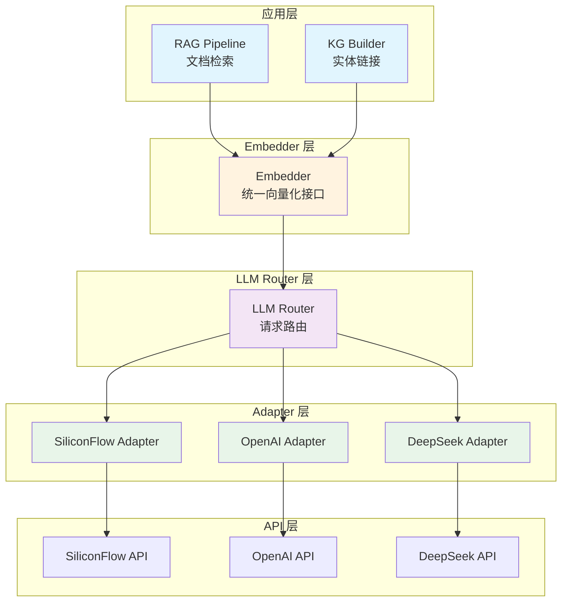
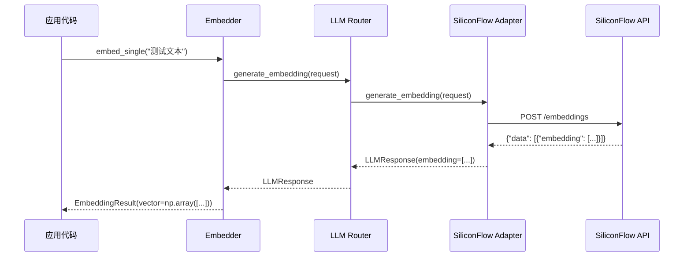
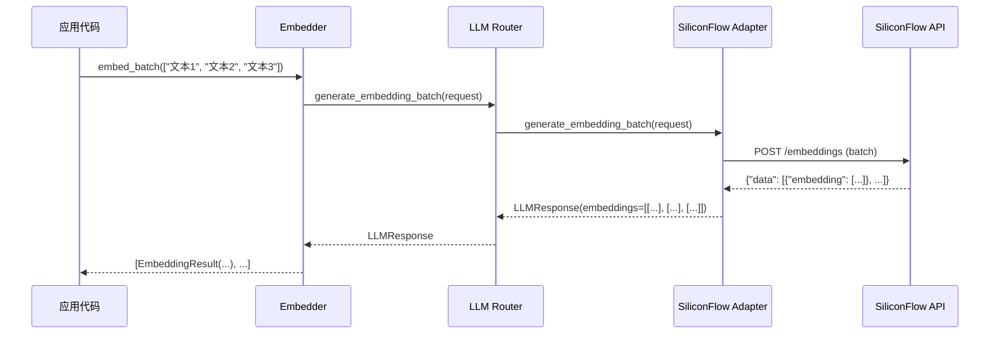

# Embedding 架构说明

## 架构概览



## 配置层次

### 1. Settings 层（配置）

```python
# backend/src/app/core/settings.py

class RAGSettings(BaseModel):
    embed_model: str = "BAAI/bge-m3"
    embed_provider: str = "siliconflow"
    # ... 其他配置

class AppSettings(BaseSettings):
    KG_EMBEDDING_MODEL: str = "BAAI/bge-m3"
    # ... 其他配置
```

**配置来源**（优先级从高到低）：
1. 环境变量（`APP_RAG__EMBED_MODEL`）
2. `.env` 文件
3. 代码默认值

### 2. Embedder 层（向量化）

```python
# backend/src/app/infrastructure/rag/embedder.py

class Embedder:
    def __init__(self, model_name: str, provider: str, batch_size: int = 32):
        self.model_name = model_name
        self.provider = provider
        self.batch_size = batch_size
        self._llm_service = self._get_llm_service()
    
    def embed_single(self, text: str) -> EmbeddingResult:
        """单文本向量化"""
        return self._call_embedding_api(text)
    
    def embed_batch(self, texts: List[str]) -> List[EmbeddingResult]:
        """批量文本向量化（推荐）"""
        return self._call_embedding_api_batch(texts)
```

**功能**：
- 统一的向量化接口
- 支持单个和批量处理
- 自动推断向量维度
- 相似度计算

### 3. LLM Router 层（路由）

```python
# backend/src/app/infrastructure/llm/router/core.py

class LLMRouter:
    def generate_embedding(self, request: LLMRequest) -> LLMResponse:
        """单个文本embedding"""
        adapter = self.get_adapter(request.provider)
        return adapter.generate_embedding(request)
    
    def generate_embedding_batch(self, request: LLMRequest) -> LLMResponse:
        """批量文本embedding"""
        adapter = self.get_adapter(request.provider)
        return adapter.generate_embedding_batch(request)
```

**功能**：
- Provider 路由选择
- 请求/响应标准化
- 延迟统计

### 4. Adapter 层（适配）

```python
# backend/src/app/infrastructure/llm/router/adapters/siliconflow.py

class SiliconFlowAdapter(OpenAIAdapter):
    def generate_embedding(self, request) -> LLMResponse:
        """调用 SiliconFlow embedding API"""
        payload = {
            "model": request.model,
            "input": request.input_text
        }
        response = httpx.post(
            f"{base_url}/embeddings",
            json=payload,
            headers={"Authorization": f"Bearer {api_key}"}
        )
        return LLMResponse(embedding=response.json()["data"][0]["embedding"])
    
    def generate_embedding_batch(self, request) -> LLMResponse:
        """批量调用 SiliconFlow embedding API"""
        payload = {
            "model": request.model,
            "input": request.input_texts  # 数组
        }
        # ... 类似逻辑
```

**功能**：
- 具体 API 调用实现
- 错误处理
- 响应解析

## 数据流

### 单文本向量化



### 批量文本向量化



## 使用场景

### RAG 系统

```python
# 文档向量化存储
from app.infrastructure.rag.embedder import Embedder
from app.core.settings import get_settings

settings = get_settings()
embedder = Embedder(
    model_name=settings.rag.embed_model,
    provider=settings.rag.embed_provider
)

# 批量处理文档
chunks = ["文档块1", "文档块2", "文档块3", ...]
results = embedder.embed_batch(chunks)

# 存储到 Qdrant
for result, chunk in zip(results, chunks):
    qdrant_store.add(
        vector=result.vector.tolist(),
        payload={"text": chunk}
    )
```

```python
# 查询向量化检索
query = "用户查询"
query_result = embedder.embed_single(query)

# 向量检索
similar_docs = qdrant_store.search(
    vector=query_result.vector.tolist(),
    limit=10
)
```

### KG 系统

```python
# 实体链接
from app.domain.kg.linker import EntityLinker

linker = EntityLinker(settings, neo4j_client)

# 计算新实体与已有实体的相似度
new_entity = "深度学习"
existing_entities = ["机器学习", "神经网络", "人工智能"]

# 内部使用 embedder
similarities = linker.compute_similarities(new_entity, existing_entities)

# 决策：复用 or 新建
if max(similarities) > settings.KG_LINK_MIN_SIM:
    # 复用已有实体
    linked_entity = existing_entities[similarities.index(max(similarities))]
else:
    # 创建新实体
    new_node = create_new_entity(new_entity)
```

## 性能优化

### 1. 批量处理

```python
# ❌ 慢：逐个处理（N次API调用）
embeddings = []
for text in texts:
    result = embedder.embed_single(text)
    embeddings.append(result)

# ✅ 快：批量处理（N/batch_size次API调用）
embeddings = embedder.embed_batch(texts)
```

**性能提升**：
- 减少API调用次数：32x
- 减少网络往返时间：95%
- 减少延迟：~80%

### 2. 缓存向量

```python
# 在 EntityLinker 中缓存已有实体的向量
class EntityLinker:
    def __init__(self, settings, neo4j_client):
        self._concept_vectors_cache = {}
    
    def get_existing_vectors(self):
        if self._concept_vectors_cache:
            return self._concept_vectors_cache
        
        # 一次性获取所有已有实体
        concepts = self.neo4j_client.get_all_concepts()
        texts = [c["name"] for c in concepts]
        
        # 批量向量化
        results = self.embedder.embed_batch(texts)
        
        # 缓存
        for concept, result in zip(concepts, results):
            self._concept_vectors_cache[concept["rid"]] = result.vector
        
        return self._concept_vectors_cache
```

### 3. 调整批处理大小

根据API限制和内存情况调整：

```python
# 默认 batch_size=32
embedder = Embedder(
    model_name="BAAI/bge-m3",
    provider="siliconflow",
    batch_size=32  # 可调整：16, 32, 64
)
```

**建议值**：
- SiliconFlow: 32-64
- OpenAI: 16-32
- 本地模型: 64-128

## 监控和调试

### 日志级别

```python
import logging

# 设置 Embedder 日志级别
logging.getLogger("app.infrastructure.rag.embedder").setLevel(logging.DEBUG)
```

### 关键日志

```
[INFO] 初始化Embedding API调用: provider=siliconflow, model=BAAI/bge-m3, dim=1024
[INFO] 开始批量嵌入 128 个文本
[DEBUG] Embedding request: model=BAAI/bge-m3, input_len=45, input_preview=这是一个测试文本...
[INFO] 批量Embedding成功: provider=siliconflow, model=BAAI/bge-m3, count=32, latency=850ms
[INFO] 批量嵌入完成: 128 个结果
```

### 常见问题排查

#### 1. 向量维度不匹配

```python
# 问题：Qdrant 报错 "vector dimension mismatch"
# 原因：切换了不同维度的 embedding 模型

# 解决：
# 1. 查看当前模型维度
print(f"Model dimension: {embedder.dimension}")

# 2. 清空 Qdrant 数据
curl -X DELETE http://localhost:6333/collections/kb_chunks

# 3. 重新创建集合（使用新维度）
# 4. 重新向量化所有文档
```

#### 2. API 调用失败

```python
# 问题：RuntimeError: SiliconFlow embedding API调用失败: 401

# 解决：
# 1. 检查 API Key 配置
settings = get_settings()
print(f"Provider: {settings.rag.embed_provider}")
print(f"Model: {settings.rag.embed_model}")

# 2. 测试 API 连接
import httpx
response = httpx.get("https://api.siliconflow.cn/v1/models")
print(response.json())

# 3. 检查模型是否支持
# 访问 https://docs.siliconflow.cn/ 确认模型可用性
```

#### 3. 性能问题

```python
# 问题：向量化速度太慢

# 诊断：
import time

start = time.time()
results = embedder.embed_batch(texts)
elapsed = time.time() - start

print(f"处理 {len(texts)} 个文本")
print(f"耗时: {elapsed:.2f}s")
print(f"平均: {elapsed/len(texts)*1000:.2f}ms/文本")

# 优化：
# 1. 增加 batch_size
embedder = Embedder(..., batch_size=64)

# 2. 使用更小维度的模型
# BAAI/bge-small-zh-v1.5 (512维) vs BAAI/bge-m3 (1024维)

# 3. 检查网络延迟
# ping api.siliconflow.cn
```

## 扩展新 Provider

### 步骤 1: 实现 Adapter

```python
# backend/src/app/infrastructure/llm/router/adapters/custom.py

from .base import BaseLLMAdapter
from ..types import LLMRequest, LLMResponse

class CustomAdapter(BaseLLMAdapter):
    def generate_embedding(self, request: LLMRequest) -> LLMResponse:
        # 实现你的 API 调用逻辑
        api_key = self._get_api_key(request)
        base_url = self._get_base_url(request) or "https://api.custom.com/v1"
        
        # 调用 API
        response = httpx.post(
            f"{base_url}/embeddings",
            json={"model": request.model, "input": request.input_text},
            headers={"Authorization": f"Bearer {api_key}"}
        )
        
        # 解析响应
        data = response.json()
        embedding = data["embedding"]  # 根据实际响应格式调整
        
        return LLMResponse(
            content="",
            model=request.model,
            provider="custom",
            embedding=embedding
        )
    
    def generate_embedding_batch(self, request: LLMRequest) -> LLMResponse:
        # 类似实现，但使用 input_texts 数组
        pass
```

### 步骤 2: 注册 Adapter

```python
# backend/src/app/infrastructure/llm/router/core.py

def _register_default_adapters(self):
    self.register_adapter("openai", OpenAIAdapter())
    self.register_adapter("siliconflow", SiliconFlowAdapter())
    self.register_adapter("deepseek", DeepSeekAdapter())
    self.register_adapter("custom", CustomAdapter())  # 新增
```

### 步骤 3: 配置使用

```yaml
# docker-compose.yml
environment:
  - APP_RAG__EMBED_PROVIDER=custom
  - APP_PROVIDERS__CUSTOM__API_KEYS=["your-key"]
  - APP_PROVIDERS__CUSTOM__BASE_URL=https://api.custom.com/v1
```

## 参考资料

- [SiliconFlow Embedding API 文档](https://docs.siliconflow.cn/api-reference/embeddings/embeddings)
- [OpenAI Embedding API 文档](https://platform.openai.com/docs/guides/embeddings)
- [BGE Embedding 模型](https://huggingface.co/BAAI/bge-m3)
- [Qdrant 向量数据库](https://qdrant.tech/documentation/)

