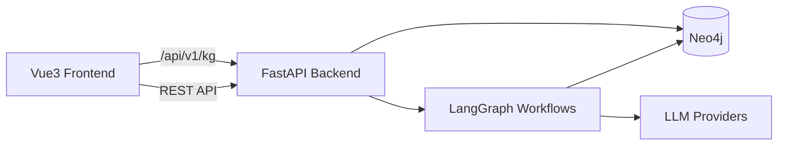
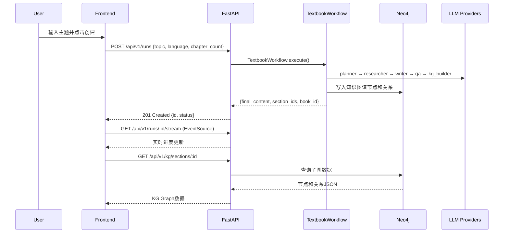
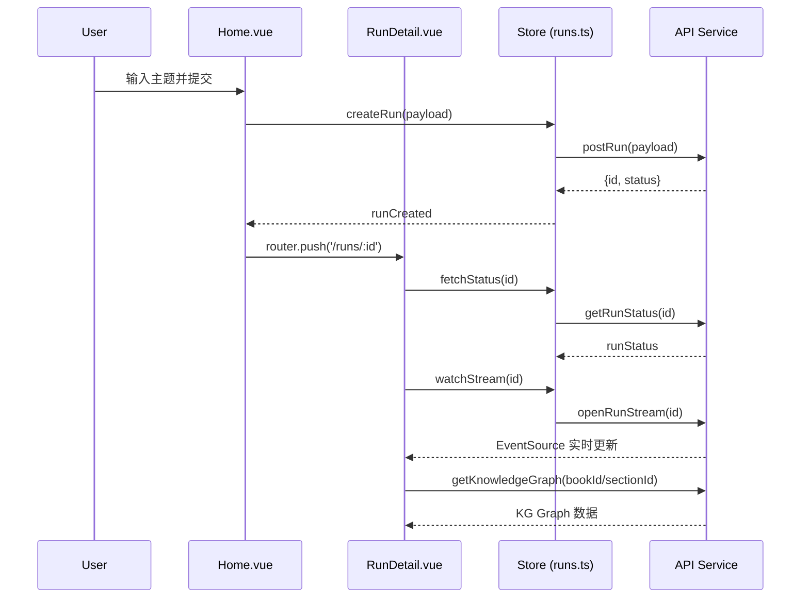

# SOPilot 项目现状说明书

> 目标：让**新接手的开发者**在 1–2 小时内通过本文档了解代码逻辑、模块协作、运行方式与前端形态，并能在 1 天内完成一次小特性或修复。

---

## 0. 快速上手（10 分钟导览）

* **仓库位置 / 分支**：`main` （稳定）
* **一键运行**：`docker compose up -d --build` 或 `pwsh -File scripts/dev.ps1`
* **调试入口**：后端 `python -m uvicorn app.asgi:app --reload --app-dir backend/src --port 8000`，前端 `npm run dev` in frontend/
* **核心路径**：

  * 后端入口：`backend/src/app/main.py`
  * LangGraph 图：`backend/src/app/domain/workflows/textbook/graph.py`
  * 知识图谱：`backend/src/app/infrastructure/graph_store/neo4j_store.py`
  * 前端路由：`frontend/src/router/index.ts`
* **黄金路径（Golden Path）**：

  1. 启动服务 → 2) 打开 `/` → 3) 输入教材主题 → 4) 触发工作流 → 5) 查看运行状态与 KG 可视化
* **示例账号/密钥**：在 `backend/.env` 配置 LLM API Key

### 0.1 详细安装指南

#### 环境准备

**必需环境：**
```bash
# 检查版本
python --version  # >= 3.11
node --version    # >= 20.0
docker --version  # >= 26.0
docker compose version  # v2.x
```

**可选环境：**
```bash
# Python包管理器（推荐）
pip install uv  # 更快的包管理器

# PowerShell（Windows）
winget install Microsoft.PowerShell  # 如果使用 scripts/dev.ps1
```

#### 快速开始（3种方式）

**方式1：Docker Compose（推荐生产）**
```bash
# 1. 克隆仓库
git clone <repository_url>
cd SOPilot

# 2. 配置环境变量
cp backend/.env.example backend/.env
# 编辑 backend/.env 文件，至少配置：
# APP_PROVIDERS__siliconflow__API_KEYS=["your_api_key"]

# 3. 一键启动
docker compose up -d --build

# 4. 验证服务
curl http://localhost:8000/api/v1/runs/health
# 前端访问：http://localhost:5173
```

**方式2：脚本启动（推荐开发）**
```powershell
# Windows PowerShell
pwsh -File scripts/dev.ps1

# 或者分步骤
pwsh -File scripts/dev.ps1 -SkipInstall  # 跳过依赖安装
```

**方式3：手动启动（调试）**
```bash
# 后端
cd backend
pip install -r requirements.txt
export PYTHONPATH=src
python -m uvicorn app.asgi:app --reload --app-dir src --port 8000

# 前端（新终端）
cd frontend  
npm install
npm run dev

# Neo4j（新终端，可选）
docker run --name neo4j -p 7474:7474 -p 7687:7687 \
  -e NEO4J_AUTH=neo4j/test1234 neo4j:5.21.0
```

#### 环境变量配置详解

创建 `backend/.env` 文件：
```bash
# 核心配置
APP_USE_REAL_WORKFLOW=true
APP_OUTPUT_DIR=/app/output

# LLM配置（选择一个提供商）
APP_DEFAULT_PROVIDER=siliconflow
# SiliconFlow
APP_PROVIDERS__siliconflow__BASE_URL=https://api.siliconflow.cn/v1
APP_PROVIDERS__siliconflow__MODEL=Qwen/Qwen3-Coder-30B-A3B-Instruct
APP_PROVIDERS__siliconflow__API_KEYS=["sk-your-api-key"]

# 或 OpenAI
# APP_DEFAULT_PROVIDER=openai
# APP_PROVIDERS__openai__BASE_URL=https://api.openai.com/v1
# APP_PROVIDERS__openai__MODEL=gpt-4o-mini
# APP_PROVIDERS__openai__API_KEYS=["sk-your-openai-key"]

# Neo4j配置
APP_NEO4J__URI=bolt://localhost:7687
APP_NEO4J__USER=neo4j
APP_NEO4J__PASSWORD=test1234
APP_NEO4J__DATABASE=neo4j

# 可选：中间件配置
APP_MIDDLEWARE__MAX_RETRIES=3
APP_MIDDLEWARE__DEFAULT_TIMEOUT=300
APP_MIDDLEWARE__REQUESTS_PER_MINUTE=60
```

#### 验证安装

运行健康检查：
```bash
# 后端健康检查
curl http://localhost:8000/api/v1/runs/health
# 期望返回：{"status": "ok"}

# Neo4j连接检查
curl -u neo4j:test1234 http://localhost:7474/db/neo4j/tx/commit \
  -H "Content-Type: application/json" \
  -d '{"statements":[{"statement":"RETURN 1 as test"}]}'

# 前端检查
curl http://localhost:5173
# 或在浏览器打开 http://localhost:5173
```

#### 常见安装问题

**问题1：端口冲突**
```bash
# 检查端口占用
netstat -an | grep ":8000\|:5173\|:7687"
# Windows: netstat -an | findstr ":8000 :5173 :7687"

# 解决方案：修改 docker-compose.yml 中的端口映射
```

**问题2：Neo4j连接失败**
```bash
# 检查Neo4j容器状态
docker logs sopilot-neo4j

# 常见原因：
# 1. 端口被占用 → 修改端口
# 2. 内存不足 → 增加Docker内存限制
# 3. 密码错误 → 检查环境变量
```

**问题3：LLM API调用失败**
```bash
# 检查API密钥
# 1. 确认密钥格式正确（JSON数组）
# 2. 确认密钥有效且有余额
# 3. 检查网络连接和代理设置
```

---

## 1. 系统总览

### 1.1 一句话说明

本项目是一个基于 **LangGraph + FastAPI + Vue3 + Neo4j 的多智能体教材生成平台**，支持智能教材创作与知识图谱构建。

#### 技术栈详细版本

**后端技术栈：**
- **FastAPI 0.115.2**：现代化Python Web框架，提供自动API文档生成
- **Uvicorn 0.30.6**：ASGI服务器，支持异步和高性能
- **Pydantic 2.9.2**：数据验证和序列化，类型安全
- **LangGraph (latest)**：工作流编排引擎，支持复杂的多智能体协作
- **LangChain Core + OpenAI**：LLM抽象层和提供商集成
- **Neo4j 5.23.1**：图数据库驱动，知识图谱存储
- **HTTPx 0.27.2**：异步HTTP客户端

**前端技术栈：**
- **Vue 3.4.0**：组合式API，响应式框架
- **TypeScript 5.5.4**：类型安全的JavaScript超集
- **Vite 5.4.0**：下一代前端构建工具，HMR支持
- **Vue Router 4.3.0**：官方路由解决方案
- **Pinia 2.1.7**：Vue状态管理，Vuex的继任者
- **Axios 1.7.2**：HTTP客户端，Promise based
- **Cytoscape 3.33.1**：图可视化库，用于知识图谱展示

**基础设施：**
- **Docker + Docker Compose**：容器化部署
- **Neo4j 5.21.0**：图数据库服务
- **PowerShell**：跨平台自动化脚本


### 1.2 架构图（简版）

> 可先用文字/表格描述，或粘贴架构图链接；若用 Mermaid：



### 1.3 运行形态 & 部署

* 本地：`Python 3.11+`、`Node.js 20+`、`Neo4j 5.21+`、`Docker 26+`
* 服务器：Docker Compose 部署
* 端口占用表：

  | 服务 | 端口 | 说明 |
  | ---- | ---- | ---- |
  | Frontend | 5173 | Vite Dev Server |
  | Backend | 8000 | FastAPI |
  | Neo4j | 7474/7687 | Web Console/Bolt |

---

## 2. 代码结构 & 约定

### 2.1 目录树（精简）

```
SOPilot/
├── backend/
│   └── src/app/
│       ├── main.py              # FastAPI 应用入口
│       ├── asgi.py              # ASGI 入口
│       ├── api/v1/              # API 路由
│       │   ├── runs.py          # 运行管理路由
│       │   └── kg.py            # 知识图谱路由
│       ├── core/                # 核心基础设施
│       │   ├── settings.py      # 配置管理
│       │   ├── logging.py       # 日志配置
│       │   └── progress_manager.py # 进度管理
│       ├── domain/              # 领域层
│       │   ├── workflows/       # LangGraph 工作流
│       │   ├── agents/          # 智能体实现
│       │   ├── kg/              # 知识图谱模块
│       │   └── state/           # 状态定义
│       ├── infrastructure/      # 基础设施层
│       │   ├── llm/             # LLM 客户端
│       │   └── graph_store/     # 图数据库
│       └── services/            # 服务层
├── frontend/
│   └── src/
│       ├── main.ts              # Vue3 入口
│       ├── router/index.ts      # 路由配置
│       ├── views/               # 页面组件
│       │   ├── Home.vue         # 创建运行页面
│       │   └── RunDetail.vue    # 运行详情页面
│       ├── components/          # 通用组件
│       │   ├── RunConsole.vue   # 运行控制台
│       │   └── KgGraph.vue      # 知识图谱可视化
│       ├── store/runs.ts        # 状态管理
│       └── services/api.ts      # API 封装
├── docker-compose.yml           # 服务编排
└── scripts/dev.ps1              # 开发脚本
```

### 2.2 命名与风格

* Python：PEP8；函数/类使用 snake_case/PascalCase；Pydantic 模型用于数据验证
* 前端：Vue3 + `<script setup>` TypeScript；组件命名 `PascalCase`；文件名 `kebab-case`

---

## 3. 模块协作 & 运行链路（**核心**）

> 本节要让读者看懂**一次功能调用从前端到后端、再到工作流/RAG/KG的全链路**。

### 3.1 功能用例清单（业务视角）

| 用例 | 入口页面 | 主要交互 | 后端路由 | 工作流/服务 | 产出 |
| ---- | -------- | -------- | -------- | ----------- | ---- |
| 教材生成 | `/` | 输入主题→点击创建 | `POST /api/v1/runs` | `TextbookWorkflow` | 教材内容、KG节点、运行状态 |
| 运行监控 | `/runs/:id` | 查看状态/日志 | `GET /api/v1/runs/:id` | `workflow_service` | 实时状态与流式日志 |
| KG可视化 | `/runs/:id` | 图谱交互 | `GET /api/v1/kg/sections/:id` | `kg_service` | 子图JSON数据 |

### 3.2 端到端时序（示例）



### 3.3 LangGraph 图 & 节点契约

* **图文件**：`backend/src/app/domain/workflows/textbook/graph.py`

* **节点列表**：

  | 节点 | 输入 State | 输出 State | 说明 |
  | ---- | ---------- | ---------- | ---- |
  | planner | {topic, language, chapter_count} | {outline, chapters} | 生成教材大纲和章节结构 |
  | researcher | {chapters} | {research_content, keywords_map} | 并发研究子章节，生成关键词与摘要 |
  | writer | {chapters, research_content} | {content, validation_results} | 并发写作与验证，闭环迭代 |
  | qa_generator | {content} | {qa_results, qa_content} | 为通过验证的内容生成问答对 |
  | kg_builder | {content} | {knowledge_graphs, section_ids} | 构建小节级知识图谱 |
  | book_graph | {knowledge_graphs} | {book_id} | 构建整本书知识图谱视图 |
  | merger | {content, qa_content} | {final_content} | 编排并合成最终教材 |

* **State 模式**：

  ```py
  class TextbookState(TypedDict, total=False):
      topic: str
      language: str
      chapter_count: int
      outline: Optional[str]
      chapters: Optional[List[Dict[str, Any]]]
      research_content: Optional[Dict[str, str]]
      content: Optional[Dict[str, str]]
      qa_results: Optional[Dict[str, Dict[str, Any]]]
      knowledge_graphs: Optional[Dict[str, Dict[str, Any]]]
      final_content: Optional[str]
      section_ids: Optional[List[str]]
      book_id: Optional[str]
  ```

#### 3.3.1 节点实现详解

**1. Planner Node（规划节点）**
- **文件位置**：`backend/src/app/domain/workflows/textbook/nodes/planner_node.py`
- **核心智能体**：`app.domain.agents.planner.Planner`
- **功能**：根据主题、语言、章节数生成教材大纲
- **并发处理**：无（单一规划任务）
- **错误处理**：异常捕获并在state中记录错误信息
- **产出**：
  ```json
  {
    "outline": "教材总体大纲文本",
    "chapters": [
      {
        "title": "章节标题",
        "subchapters": [
          {"title": "子章节标题", "description": "简介"}
        ]
      }
    ]
  }
  ```

**2. Researcher Node（研究节点）**
- **文件位置**：`backend/src/app/domain/workflows/textbook/nodes/researcher_node.py`
- **核心智能体**：`app.domain.agents.researcher.Researcher`
- **功能**：为每个子章节生成研究内容和关键词
- **并发处理**：支持（可配置max_workers）
- **特点**：
  - 生成子章节的背景研究内容
  - 提取关键词用于后续KG构建
  - 为写作节点提供参考资料
- **产出**：
  ```json
  {
    "research_content": {
      "子章节标题": "研究内容文本"
    },
    "subchapter_keywords_map": {
      "子章节标题": ["关键词1", "关键词2"]
    }
  }
  ```

**3. Writer Node（写作节点）**
- **文件位置**：`backend/src/app/domain/workflows/textbook/nodes/writer_node.py`
- **核心智能体**：`Writer`、`Validator`、`QAGenerator`
- **功能**：并发写作子章节内容并进行质量验证
- **并发处理**：支持（ThreadPoolExecutor）
- **验证机制**：
  - 写作完成后自动调用Validator验证
  - 不通过则重写（可配置最大重试次数）
  - 通过验证的内容自动生成QA
- **配置项**：
  ```python
  max_workers = concurrency_config["writer"]["max_workers"]
  max_rewrite_attempts = concurrency_config["validator"]["max_rewrite_attempts"]
  ```
- **产出**：
  ```json
  {
    "content": {"子章节标题": "章节内容"},
    "validation_results": {
      "子章节标题": {
        "is_passed": true,
        "score": 8.5,
        "feedback": "质量评估反馈"
      }
    },
    "qa_content": {"子章节标题": "QA内容"},
    "qa_metadata": {"子章节标题": {...}}
  }
  ```

**4. QA Generator Node（问答生成节点）**
- **文件位置**：`backend/src/app/domain/workflows/textbook/nodes/qa_node.py`
- **功能**：为缺失QA的内容补充问答对
- **触发条件**：writer节点未生成QA或QA质量不达标
- **并发处理**：支持
- **产出**：补充缺失的qa_results和qa_content

**5. KG Builder Node（知识图谱构建节点）**
- **文件位置**：`backend/src/app/domain/workflows/textbook/nodes/kg_node.py`
- **核心模块**：`KGPipeline`、`KGMerger`
- **功能**：为通过验证的子章节构建知识图谱
- **处理流程**：
  1. 筛选验证通过的子章节
  2. 并发为每个子章节构建KG
  3. 生成唯一的section_id
  4. 存储到Neo4j数据库
- **并发配置**：`kg_builder.max_workers`
- **产出**：
  ```json
  {
    "knowledge_graphs": {
      "子章节标题": {"nodes": [...], "edges": [...]}
    },
    "section_ids": ["section_1", "section_2"]
  }
  ```

**6. Book Graph Node（整书图谱节点）**
- **文件位置**：`backend/src/app/domain/workflows/textbook/nodes/book_graph_node.py`
- **功能**：将各小节KG合并为整本书的知识图谱（B1方案实现）
- **核心机制**：
  - **多Scope支持**：区分section级和book级图谱
  - **幂等写入**：使用rid（关系ID）确保数据一致性
  - **替换模式**：按scope删除旧数据再插入新数据
- **处理流程**：
  1. 收集所有通过验证的section_ids的KG数据
  2. 生成唯一book_id：`book:{topic}:{8位时间戳}`
  3. 为每条边添加完整属性：
     ```json
     {
       "source_id": "源节点ID",
       "target_id": "目标节点ID",
       "scope": "book:topic:timestamp",  // 整本书范围
       "src": "section_id",              // 来源小节
       "rid": "relation_unique_id",      // 关系唯一ID
       "type": "关系类型"
     }
     ```
  4. 删除现有book scope的关系（幂等性保证）
  5. 批量写入整本书的图谱关系
- **产出**：
  ```json
  {
    "book_id": "book:python_basics:0d24a9b7",
    "nodes_written": 22,
    "edges_written": 46,
    "success": true
  }
  ```

**7. Merger Node（合并节点）**
- **文件位置**：`backend/src/app/domain/workflows/textbook/nodes/merger_node.py`
- **核心模块**：`app.domain.workflows.textbook.merger.Merger`
- **功能**：将所有内容合并为最终教材
- **合并内容**：
  - 教材正文内容
  - QA问答部分
  - 章节结构和目录
- **产出**：
  ```json
  {
    "final_content": "完整的教材Markdown内容"
  }
  ```

#### 3.3.2 并发配置

工作流支持细粒度的并发控制，配置文件：`backend/src/app/core/concurrency.py`

```python
{
  "writer": {"max_workers": 3},
  "validator": {"max_rewrite_attempts": 2},
  "kg_builder": {"max_workers": 2},
  "qa_generator": {"max_workers": 2}
}
```

#### 3.3.3 错误处理策略

每个节点都实现了统一的错误处理模式：
1. **异常捕获**：捕获所有异常并记录日志
2. **状态传播**：在state中添加error字段
3. **优雅降级**：错误状态下跳过后续节点
4. **错误恢复**：支持从断点继续执行（LangGraph checkpointer）

### 3.4 RAG 管道（最小可用）

本项目主要专注于教材生成和知识图谱构建，暂未实现传统的RAG检索增强生成管道。

* **关键函数**：TBD - 未来可集成向量检索功能

* **向量库**：TBD - 可考虑集成FAISS/Chroma/PgVector

### 3.5 知识图谱（Neo4j）模型

#### 3.5.1 数据模型设计

**节点类型定义：**
- **ChapterNode**：章节节点，表示教材的主要章节
- **SubchapterNode**：子章节节点，章节下的具体小节
- **ConceptNode**：概念节点，知识点、算法、实体等

**节点属性结构：**
```json
{
  "id": "unique_identifier",          // 全局唯一ID
  "type": "concept|chapter|subchapter", // 节点类型
  "name": "节点名称",                   // 显示名称
  "description": "节点描述",            // 详细描述
  "properties": {...},                // 扩展属性
  "created_at": "2024-01-01T00:00:00Z", // 创建时间
  "updated_at": "2024-01-01T00:00:00Z"  // 更新时间
}
```

**关系属性结构：**
```json
{
  "source_id": "源节点ID",
  "target_id": "目标节点ID", 
  "type": "关系类型",
  "src": "section_id",              // 来源小节ID
  "scope": "book_id",               // 所属书籍ID
  "weight": 0.8,                    // 关系权重（可选）
  "properties": {...},              // 扩展属性
  "created_at": "2024-01-01T00:00:00Z"
}
```

#### 3.5.2 数据组织策略

**多Scope分层存储（B1方案核心）：**
1. **Section Scope**：`section_id` - 小节级图谱
   - 存储单个小节的知识结构
   - 快速查询特定小节内容
   - 支持增量构建和更新
2. **Book Scope**：`book:{topic}:{timestamp}` - 整本书级图谱
   - 合并所有小节的知识结构
   - 提供完整的书籍知识视图
   - 支持跨章节知识关联分析
3. **节点共享**：相同概念的节点在不同scope间复用

**幂等性保证机制：**
- **RID（关系ID）**：每条关系的唯一标识符
- **替换模式**：按scope删除旧关系再插入新关系
- **内容哈希**：基于节点内容生成唯一ID避免重复

**查询优化策略：**
- 为 `section_id`、`scope`、`rid` 创建复合索引
- 前端优先查询Book Scope，回退到Section Scope
- 支持按层次和关系类型的多维度查询

#### 3.5.3 Cypher 查询示例

**节点创建/更新：**
  ```cypher
MERGE (n:ConceptNode {id: $id})
SET n += $properties
SET n.updated_at = datetime()
RETURN n.id as node_id
```

**关系创建：**
```cypher
MATCH (source {id: $source_id}), (target {id: $target_id})
MERGE (source)-[r:RELATES_TO]->(target)
SET r += $properties
SET r.created_at = datetime()
RETURN r
```

**小节图谱查询：**
```cypher
MATCH ()-[r]->() WHERE r.src = $section_id
RETURN properties(r) AS edge

MATCH ()-[r]->() WHERE r.src = $section_id
WITH collect(DISTINCT r.source_id) + collect(DISTINCT r.target_id) AS ids
UNWIND ids AS nid MATCH (n {id: nid})
RETURN DISTINCT properties(n) AS node
```

**整书图谱查询：**
```cypher
MATCH ()-[r]->() WHERE r.scope = $scope
RETURN properties(r) AS edge
```

#### 3.5.4 数据一致性保证

**替换模式：**
- 按 `section_id` 删除旧关系再插入新关系
- 避免数据重复和不一致

**幂等性：**
- 使用 `MERGE` 操作确保节点唯一性
- 基于 `content_hash` 的增量更新

**事务处理：**
- 批量操作使用事务保证原子性
- 异常情况下自动回滚

---

## 4. API 合同（Contract-First）

> 前后端联调以此为准（**路径、方法、参数、响应、错误码**）。

### 4.1 创建运行

* **POST** `/api/v1/runs`
* **Body**

  ```json
  {
    "topic": "大型语言模型与知识图谱",
    "language": "中文",
    "chapter_count": 3
  }
  ```
* **201 响应**

  ```json
  {
    "id": "run_12345678",
    "status": "created"
  }
  ```
* **错误码**：`400` 参数错误；`500` 内部错误

### 4.2 获取运行状态

* **GET** `/api/v1/runs/{run_id}`
* **200 响应**：

  ```json
  {
    "id": "run_12345678",
    "status": "completed",
    "result": {
      "final_content": "...",
      "section_ids": ["section_1", "section_2"],
      "book_id": "book:python_basics:12345678"
    },
    "updated_at": 1640995200
  }
  ```

### 4.3 流式监控

* **GET** `/api/v1/runs/{run_id}/stream`
* **EventSource 响应**：实时进度事件流

### 4.4 知识图谱查询

* **GET** `/api/v1/kg/sections/{section_id}`
* **GET** `/api/v1/kg/books/{book_id}`
* **200 响应**：

  ```json
  {
    "nodes": [{"id": "node1", "type": "concept", "properties": {...}}],
    "edges": [{"source": "node1", "target": "node2", "type": "relates_to"}]
  }
  ```

> 其余接口请逐条列出。建议生成 `openapi.json` 并在前端用 `swagger-ui`/`Redoc` 内嵌。

---

## 5. 前端形态（**直观看到“长什么样”**）

### 5.1 路由表

| 路由 | 页面 | 权限 | 说明 |
| ---- | ---- | ---- | ---- |
| `/` | Home.vue | 无 | 创建新的教材生成运行 |
| `/runs/:id` | RunDetail.vue | 无 | 查看运行状态和知识图谱 |

### 5.2 组件树

```
App.vue
├─ router-view
│  ├─ Home.vue (/)
│  │  └─ form (主题输入表单)
│  └─ RunDetail.vue (/runs/:id)
│     ├─ RunConsole.vue (运行日志显示)
│     └─ KgGraph.vue (知识图谱可视化)
```

### 5.3 交互流程（页面级时序）



### 5.4 视觉与状态

* 设计约束：暗色主题、最小化设计、响应式布局
* 全局状态：Pinia Store (`runs.ts`) 管理运行状态、日志、KG数据
* 错误可视化：控制台错误显示、状态码提示

#### 5.4.1 前端状态管理详解

**Pinia Store 结构 (`frontend/src/store/runs.ts`)：**
```typescript
interface RunState {
  status: RunStatus | null        // 当前运行状态
  logs: string[]                  // 实时日志数组
  currentRunId: string | null     // 当前运行ID
  isStreaming: boolean           // 是否正在流式监听
  error: string | null           // 错误信息
}

interface RunStatus {
  id: string
  status: 'created' | 'running' | 'completed' | 'failed'
  result?: {
    final_content?: string
    section_ids?: string[]
    book_id?: string
  }
  error?: string
  updated_at?: number
}
```

**核心 Actions：**
- `createRun(payload)`: 创建新的教材生成运行
- `fetchStatus(runId)`: 获取运行状态
- `watchStream(runId)`: 开启EventSource实时监听
- `stopStream()`: 停止流式监听
- `addLog(message)`: 添加日志信息
- `clearLogs()`: 清空日志

**状态流转：**
```
创建运行 → 获取状态 → 开启流式监听 → 实时更新 → 完成/错误
```

#### 5.4.2 组件实现详解

**KgGraph.vue（知识图谱可视化）：**
- **依赖**：Cytoscape.js 3.33.1
- **功能**：
  - **双模式支持**：整本书图谱（优先）+ 小节图谱（备选）
  - **智能数据源选择**：实现B1方案的前端逻辑
  - 自动布局算法（cola、cose等）
  - 节点/边的交互操作
  - 响应式容器大小调整
- **核心逻辑**：
  ```typescript
  interface KgGraphProps {
    bookId?: string     // 整本书ID，优先使用
    sectionId?: string  // 小节ID，备选方案
  }
  
  // B1方案：优先级数据获取策略
  const loadGraph = async () => {
    try {
      if (bookId) {
        // 优先使用整本书图谱（B1方案核心）
        const data = await getKnowledgeGraph(bookId, null)
        setTitle("整本书知识图谱")
        renderCytoscape(data)
      } else if (sectionId) {
        // 备选：使用小节图谱
        const data = await getKnowledgeGraph(null, sectionId)
        setTitle("小节知识图谱")
        renderCytoscape(data)
      } else {
        showEmptyState()
      }
    } catch (error) {
      showErrorState(error)
    }
  }
  ```
- **视觉区分**：
  - 整本书图谱：显示完整的跨章节知识结构
  - 小节图谱：显示局部的知识点关联

**RunConsole.vue（运行控制台）：**
- **功能**：
  - 实时日志流展示
  - 自动滚动到底部
  - 时间戳格式化
  - 日志级别颜色区分
- **响应式设计**：
  ```vue
  <template>
    <div class="console">
      <div v-for="log in logs" :key="log.id" class="log-entry">
        {{ formatTimestamp(log.timestamp) }} {{ log.message }}
      </div>
    </div>
  </template>
  ```

#### 5.4.3 样式系统

**设计令牌（CSS Variables）：**
```css
:root {
  --color-bg-primary: #0e0f12;      /* 主背景色 */
  --color-bg-secondary: #1a1b1e;    /* 次要背景色 */
  --color-text-primary: #ffffff;     /* 主文本色 */
  --color-text-secondary: #999999;   /* 次要文本色 */
  --color-accent: #66fcf1;          /* 强调色 */
  --color-border: #333333;          /* 边框色 */
  --color-error: #ff6b6b;           /* 错误色 */
  --color-success: #51cf66;         /* 成功色 */
}
```

**响应式断点：**
```css
/* Mobile */
@media (max-width: 768px) { ... }
/* Tablet */
@media (min-width: 769px) and (max-width: 1024px) { ... }
/* Desktop */
@media (min-width: 1025px) { ... }
```

**组件样式约定：**
- 使用 `scoped` 样式避免污染
- 原子化CSS类命名（`.btn`, `.card`, `.form-group`）
- 深色优先的颜色方案

> 若已有界面截图，请在本节粘贴或链接到 `/docs/ui/` 目录。

---

## 6. 配置、密钥与环境

* `.env.example` 字段表

  | 键 | 示例值 | 说明 |
  | -- | ------ | ---- |
  | APP_USE_REAL_WORKFLOW | true | 是否使用真实工作流 |
  | APP_DEFAULT_PROVIDER | siliconflow | 默认LLM提供商 |
  | APP_PROVIDERS__siliconflow__BASE_URL | https://api.siliconflow.cn/v1 | LLM API基础URL |
  | APP_PROVIDERS__siliconflow__MODEL | Qwen/Qwen3-Coder-30B-A3B-Instruct | LLM模型名称 |
  | APP_PROVIDERS__siliconflow__API_KEYS | ["sk-xxx"] | LLM API密钥列表 |
  | APP_NEO4J__URI | bolt://neo4j:7687 | Neo4j连接URI |
  | APP_NEO4J__USER | neo4j | Neo4j用户名 |
  | APP_NEO4J__PASSWORD | test1234 | Neo4j密码 |
  | APP_OUTPUT_DIR | /app/output | 运行产物输出目录 |
* 多环境配置：支持 `APP_*` 前缀环境变量覆盖，嵌套使用 `__` 分隔符

---

## 7. 数据与存储

* 原始文档：运行产物存储在 `./output/<run_id>/` 目录，包含状态JSON、最终内容MD、KG section IDs
* 向量库：暂未集成，可考虑未来添加向量检索功能
* Neo4j：存储知识图谱节点和关系，按 `section_id` 和 `scope` 组织
* 数据生命周期：运行创建→工作流执行→KG构建→产物落盘→可视化查询

---

## 8. 测试、质量与可观测性

* 测试矩阵：主要依赖手动测试，未配置自动化测试
* 覆盖率阈值：TBD
* 日志：结构化日志，支持进度跟踪和错误处理
* 监控：EventSource 实时流、运行状态监控、Neo4j 连接状态

---

## 8.1 端到端业务流与状态机

### Run全生命周期状态机

**状态转换流程：**
```
created → pending → running → succeeded/failed/cancelled
```

**状态定义与进入条件：**

| 状态 | 进入条件 | 可观测字段 | 退出条件 | 失败回退策略 |
|------|----------|------------|----------|------------|
| `created` | 用户提交POST请求 | `created_at`, `topic`, `chapter_count` | 工作流启动 | 立即失败 |
| `pending` | Run创建成功 | `id`, `status`, `updated_at` | 工作流开始执行 | 标记失败 |
| `running` | 工作流开始执行 | 进度事件、节点状态、实时日志 | 工作流完成/异常 | 保留中间产物，可从断点恢复 |
| `succeeded` | 所有节点成功完成 | `final_content`, `section_ids`, `book_id` | 终态 | N/A |
| `failed` | 任意节点异常终止 | `error` 消息、失败节点信息 | 终态 | 保留已生成内容 |
| `cancelled` | 用户主动取消 | `cancelled_at`, 取消原因 | 终态 | 保留已生成内容 |

**取消/超时/重入语义：**

- **取消权限**：当前仅支持系统级取消（异常终止），用户主动取消功能TBD
- **产物保留**：取消后保留 `./output/<run_id>/` 下的所有已生成内容
- **超时策略**：
  - 节点级超时：`300s`（可配置 `_TIMEOUT` 环境变量）
  - LLM调用超时：`300s`（middleware层控制）
  - 超时后标记为`failed`，但支持从checkpointer恢复
- **重入机制**：LangGraph支持checkpointer恢复，但当前实现为每次新建Run

### 工作流节点状态追踪

**节点执行进度事件：**
```typescript
interface ProgressEvent {
  type: 'node_start' | 'node_progress' | 'node_end' | 'node_error'
  node: 'planner' | 'researcher' | 'writer' | 'qa_generator' | 'kg_builder' | 'book_graph' | 'merger'
  data: {
    stage_description?: string
    progress_percent?: number
    error_message?: string
    stats?: Record<string, any>
  }
  timestamp: number
}
```

---

## 8.2 节点级"契约"细化

### 输入输出Schema规范

**完整TextbookState定义：**
```python
class TextbookState(TypedDict, total=False):
    # 输入参数
    topic: str                                    # 必填：教材主题
    language: str                                 # 默认"中文"
    num_chapters: int                            # 必填：章节数（1-20）
    chapter_count: int                           # 与num_chapters保持一致
    thread_id: Optional[str]                     # 工作流线程ID
    
    # 规划阶段输出
    outline: Optional[str]                       # 大纲文本
    chapters: Optional[List[ChapterDict]]        # 结构化章节数据
    
    # 研究阶段输出
    research_content: Optional[Dict[str, str]]   # {子章节名: 研究内容}
    subchapter_keywords_map: Optional[Dict[str, List[str]]]  # {子章节名: [关键词]}
    chapter_keywords_map: Optional[Dict[str, List[str]]]     # {章节名: [关键词]}
    global_unique_keywords: Optional[List[str]]  # 全书去重关键词
    
    # 写作阶段输出
    content: Optional[Dict[str, str]]            # {子章节名: 正文内容}
    validation_results: Optional[Dict[str, ValidationResult]]  # 验证结果
    
    # QA生成输出
    qa_results: Optional[Dict[str, Dict[str, Any]]]  # QA结构化数据
    qa_content: Optional[Dict[str, str]]         # QA文本内容
    qa_metadata: Optional[Dict[str, Any]]        # QA元数据
    
    # KG构建输出
    knowledge_graphs: Optional[Dict[str, KgDict]]  # {子章节名: KG数据}
    section_ids: Optional[List[str]]             # 小节图谱ID列表
    book_id: Optional[str]                       # 整本书图谱ID
    
    # 最终输出
    final_content: Optional[str]                 # Markdown格式完整教材
    
    # 错误处理
    error: Optional[str]                         # 错误信息
    config: Optional[Dict[str, Any]]             # 运行时配置
```

### 边界条件与重试策略

**节点级重试配置：**
```python
{
  "writer": {
    "max_workers": 50,           # 并发数上限
    "timeout": 300,              # 单节点超时(秒)
    "retry_count": 3,            # LLM调用重试次数
    "chunk_size": 10             # 批处理大小
  },
  "validator": {
    "max_rewrite_attempts": 1,   # 验证失败后重写次数
    "pass_threshold": 7.0        # 通过阈值(1-10分)
  },
  "kg_builder": {
    "max_workers": 50,
    "timeout": 300,
    "retry_count": 3
  }
}
```

**重试触发条件：**
- `LLMNetworkException`：网络超时、连接失败
- `LLMServerException`：5xx服务器错误  
- `LLMRateLimitException`：429限流错误

**退避策略：**
- 指数退避：`delay = base_delay * (2 ** attempt)`
- 最大延迟：`60s`
- 添加随机抖动：`delay *= (0.5 + random() * 0.5)`

### 确定性/随机性开关

**LLM调用参数：**
```python
llm_call_params = {
    "temperature": 0.7,      # 可配置：0.0(确定性) - 1.0(随机性)
    "top_p": 0.9,           # 可配置：nucleus sampling
    "max_tokens": 2000,     # 输出长度限制
    "seed": None            # 可选：固定种子确保可复现
}
```

**可复现实验配置：**
```python
deterministic_config = {
    "temperature": 0.0,
    "top_p": 1.0,  
    "seed": 42,
    "frequency_penalty": 0.0,
    "presence_penalty": 0.0
}
```

---

## 8.3 提示词与内容生成策略

### Prompt模板规范

**Planner节点Prompt：**
- **模板变量**：`{topic}`, `{chapter_count}`, `{language}`
- **输出约束**：纯JSON格式，禁用```代码块
- **失败处理**：空响应重试，格式错误降级为默认大纲

**Writer节点Prompt：**
- **模板变量**：`{topic}`, `{subchapter_title}`, `{subchapter_outline}`, `{subchapter_keywords}`, `{research_summary}`, `{chapter_title}`, `{rewrite_instructions}`
- **输出格式**：Markdown，包含4个固定section（概述、核心内容、技术实现、实践指导）
- **长度约束**：
  - 概述：200-300字
  - 核心内容：800-1200字  
  - 技术实现：400-600字
  - 实践指导：300-400字

**Validator节点Prompt：**
- **评分维度**：内容完整性、技术准确性、逻辑连贯性、语言表达
- **输出格式**：结构化评分报告
- **通过标准**：总体评分≥7.0分

**KG Builder Prompt：**
- **输出格式**：三层结构（节点、关系、层次）
- **关系类型**：`RELATES_TO`, `PART_OF`, `REQUIRES`, `CONTRASTS_WITH`

### 语言与风格参数

**内容生成策略：**
```python
content_style_params = {
    "target_audience": "初学者|进阶|专家",
    "language_tone": "学术|科普|实用",
    "difficulty_level": "入门|中级|高级", 
    "content_density": "简明|详细|深入"
}
```

### 提供商与模型优先级

**多提供商切换策略：**
```python
provider_fallback_matrix = {
    "primary": "siliconflow:Qwen/Qwen3-Coder-30B-A3B-Instruct",
    "fallback_1": "openai:gpt-4o-mini",
    "fallback_2": "deepseek:deepseek-coder",
    "local": "ollama:qwen2.5-coder"
}

切换规则 = {
    "连续失败5次": "切换到下一级提供商",
    "成功2次": "尝试恢复到上一级",
    "成本控制": "任务类型→模型映射(规划用大模型,QA用小模型)"
}
```

---

## 8.4 内容与图谱数据契约

### 章节内容结构规范

**子章节标准格式：**
```markdown
## 子章节标题

### 概述（200-300字）
- 学习目标和重要性
- 在章节中的作用和地位  
- 与其他部分的关联关系

### 核心内容（800-1200字）
- 理论原理和概念解释
- 关键词深入讲解
- 实际应用场景

### 技术实现（400-600字）
- 具体实现方法和步骤
- 关键代码片段和示例
- 注意事项和最佳实践

### 实践指导（300-400字）
- 操作指南和学习建议
- 常见问题和解决方案
- 进阶学习路径
```

### 概念去重/归一策略

**概念Key规范化规则：**
```python
def normalize_concept_key(concept: str) -> str:
    """概念键标准化算法"""
    # 1. 转换为小写
    normalized = concept.lower()
    
    # 2. 移除标点和特殊字符
    normalized = re.sub(r'[^\w\u4e00-\u9fa5]', '', normalized)
    
    # 3. 中文同义词映射
    synonyms = {"机器学习": "ml", "深度学习": "dl", "人工智能": "ai"}
    normalized = synonyms.get(normalized, normalized)
    
    # 4. 英文词形还原
    normalized = lemmatize(normalized)  # 使用NLTK
    
    # 5. 生成哈希ID
    return hashlib.md5(normalized.encode()).hexdigest()[:8]
```

### 关系类型枚举与语义

**标准关系类型定义：**
```python
class RelationType(Enum):
    RELATES_TO = "relates_to"      # 一般关联：概念间的通用连接
    PART_OF = "part_of"           # 包含关系：A是B的组成部分
    REQUIRES = "requires"          # 依赖关系：A需要先掌握B
    CONTRASTS_WITH = "contrasts_with"  # 对比关系：A与B形成对比
    IMPLEMENTS = "implements"      # 实现关系：A实现了B
    EXTENDS = "extends"           # 扩展关系：A扩展了B
    SIMILAR_TO = "similar_to"     # 相似关系：A与B相似
```

**关系属性规范：**
```json
{
  "source_id": "concept_node_id",
  "target_id": "concept_node_id", 
  "type": "RelationType",
  "weight": 0.8,                 # 关系强度(0-1)
  "direction": "bidirectional",  # 方向性
  "scope": "section_id|book_id", # 所属范围
  "src": "section_id",           # 来源小节
  "confidence": 0.9,             # 置信度(0-1)
  "created_at": "2024-01-01T00:00:00Z"
}
```

### 幂等与冲突解决

**RID构造公式：**
```python
def generate_rid(source_id: str, target_id: str, relation_type: str, scope: str, content_hash: str) -> str:
    """生成关系唯一标识符"""
    payload = f"{source_id}|{target_id}|{relation_type}|{scope}|{content_hash}"
    return hashlib.sha256(payload.encode()).hexdigest()[:16]
```

**冲突解决规则：**
1. **时间优先**：`created_at`较新的关系获胜
2. **置信度优先**：`confidence`分数更高的获胜  
3. **来源优先**：整书级别的关系优于小节级别
4. **内容哈希**：相同内容的关系进行合并而非覆盖

---

## 8.5 查询与分页/增量加载

### KG查询API分页策略

**查询限制参数：**
```python
kg_query_limits = {
    "max_nodes": 1000,           # 单次查询最大节点数
    "max_edges": 2000,           # 单次查询最大边数  
    "max_depth": 3,              # 遍历深度限制
    "timeout": 30                # 查询超时(秒)
}
```

**分页查询接口：**
```python
GET /api/v1/kg/sections/{section_id}?limit=100&offset=0&node_types=concept,chapter
GET /api/v1/kg/books/{book_id}?limit=100&offset=0&depth=2
```

**过滤条件支持：**
- `node_types`: 按节点类型过滤（concept, chapter, subchapter）
- `relation_types`: 按关系类型过滤  
- `weight_threshold`: 按关系权重过滤
- `depth`: 图遍历深度限制

### 增量加载协议

**前端分层加载策略：**
```typescript
interface KgLoadingStrategy {
  // 初始加载：核心节点
  initial: {
    node_limit: 20,
    core_concepts_only: true,
    min_weight: 0.7
  },
  
  // 点击展开：邻接节点
  expansion: {
    k_hop: 1,               // 1跳邻居
    max_additional_nodes: 10,
    relation_filter: ["relates_to", "part_of"]
  },
  
  // 全图模式：完整数据
  full_graph: {
    lazy_loading: true,     // 懒加载边
    viewport_culling: true  // 视口外剔除
  }
}
```

---

## 8.6 并发与背压控制

### 章节级并发限制

**动态降档策略：**
```python
class ConcurrencyController:
    def __init__(self):
        self.base_workers = 50
        self.min_workers = 5
        self.failure_threshold = 5
        self.current_workers = self.base_workers
        
    def handle_failure(self, error_type: str):
        if error_type == "rate_limit":
            # 429限流 → 减半并发 + 增加间隔
            self.current_workers = max(self.min_workers, self.current_workers // 2)
            self.request_interval *= 2
        elif error_type == "timeout": 
            # 超时 → 减少并发
            self.current_workers = max(self.min_workers, self.current_workers - 10)
```

### 写作-验证闭环配置

**重写循环参数：**
```python
writer_validation_config = {
    "max_rewrite_attempts": 1,      # 最大重写次数
    "pass_threshold": 7.0,          # 验证通过阈值  
    "fail_fast": True,             # 快速失败模式
    "fallback_strategy": "placeholder"  # 失败兜底策略
}

# 兜底策略选项：
fallback_options = {
    "placeholder": "生成学习指引占位内容",
    "simplified": "生成简化版本内容", 
    "outline_only": "仅保留大纲结构",
    "skip": "跳过该子章节"
}
```

---

## 8.7 前端交互契约详解

### EventSource消息协议

**事件类型枚举：**
```typescript
interface SSEEvent {
  event: 'log' | 'progress' | 'node_start' | 'node_end' | 'warning' | 'error' | 'done'
  data: string | ProgressData | ErrorData
  id?: string
  retry?: number
}

interface ProgressData {
  node: string
  stage: string  
  percent?: number
  stats?: Record<string, any>
}

interface ErrorData {
  error_type: 'validation' | 'llm_api' | 'network' | 'timeout'
  message: string
  node?: string
  recoverable: boolean
}
```

**前端事件处理：**
```typescript
const eventSource = new EventSource(`/api/v1/runs/${runId}/stream`)

eventSource.addEventListener('log', (e) => {
  runsStore.addLog(e.data)
})

eventSource.addEventListener('progress', (e) => {
  const progress = JSON.parse(e.data)
  runsStore.updateProgress(progress.node, progress.percent)
})

eventSource.addEventListener('error', (e) => {
  const error = JSON.parse(e.data)
  runsStore.setError(error.message)
})
```

### Graph操作事件映射

**KgGraph.vue交互映射：**
```typescript
interface GraphInteraction {
  // 节点点击 → 详情查询
  'node:click': (nodeId: string) => {
    // API调用: GET /api/v1/kg/nodes/{nodeId}/details
    showNodeDetails(nodeId)
  },
  
  // 边点击 → 关系详情  
  'edge:click': (edgeId: string) => {
    // API调用: GET /api/v1/kg/edges/{edgeId}/details
    showEdgeDetails(edgeId)
  },
  
  // 框选 → 批量操作
  'nodes:select': (nodeIds: string[]) => {
    // API调用: POST /api/v1/kg/subgraph with nodeIds
    highlightSubgraph(nodeIds)
  },
  
  // 搜索 → 过滤显示
  'graph:search': (query: string) => {
    // API调用: GET /api/v1/kg/search?q={query}
    filterBySearch(query)
  }
}
```

### 路由参数与深链

**深链接URL格式：**
```
/runs/:id?view=book&scope=book:xxx&node=node123&tab=content
```

**参数解析规则：**
```typescript
interface RouteParams {
  id: string                    // 必需：运行ID
  view?: 'section' | 'book'    // 可选：视图模式，默认'book'
  scope?: string               // 可选：图谱范围ID
  node?: string                // 可选：高亮节点ID
  tab?: 'content' | 'kg' | 'qa' // 可选：标签页，默认'content'
}

// 页面初始化状态还原
function restoreStateFromRoute(params: RouteParams) {
  if (params.scope) {
    await loadKgGraph(params.scope)
  }
  if (params.node) {
    highlightNode(params.node)
    centerViewOnNode(params.node)
  }
  if (params.tab) {
    switchToTab(params.tab)
  }
}
```

---

## 8.8 输入约束与配额

### 输入验证规则

**RunCreate Schema约束：**
```python
class RunCreate(BaseModel):
    topic: str = Field(
        ..., 
        min_length=2, 
        max_length=200, 
        description="教材主题",
        regex=r"^[\u4e00-\u9fa5a-zA-Z0-9\s\-_]+$"  # 中英文数字空格连字符下划线
    )
    language: str = Field(
        "中文", 
        regex=r"^(中文|English|Français|Deutsch|日本語)$",
        description="生成语言"
    )
    chapter_count: int = Field(
        ge=1, 
        le=20, 
        description="章节数"
    )
```

**长度限制配置：**
```python
content_budget = {
    "max_subchapter_tokens": 2000,    # 单个子章节最大token数
    "max_book_tokens": 50000,         # 整本书最大token数  
    "max_outline_length": 5000,       # 大纲最大字符数
    "max_qa_pairs_per_section": 8,    # 每小节QA对数量上限
}

# 超限处理策略
overflow_strategy = {
    "subchapter_overflow": "truncate_and_warn",  # 截断并警告
    "book_overflow": "split_into_volumes",       # 分卷处理
    "outline_overflow": "compress_descriptions"   # 压缩描述
}
```

### 错误码与提示文案

**输入验证错误码：**
```python
validation_errors = {
    "TOPIC_TOO_SHORT": {"code": 4001, "message": "主题长度不能少于2个字符"},
    "TOPIC_TOO_LONG": {"code": 4002, "message": "主题长度不能超过200个字符"},
    "INVALID_LANGUAGE": {"code": 4003, "message": "不支持的语言类型"},
    "CHAPTER_COUNT_OUT_OF_RANGE": {"code": 4004, "message": "章节数必须在1-20之间"},
    "CONTENT_TOO_LONG": {"code": 4005, "message": "内容超出长度限制，建议分卷处理"},
}
```

---

## 8.9 质量与安全控制

### 内容质量门槛

**验证维度权重：**
```python
quality_metrics = {
    "content_completeness": {      # 内容完整性
        "weight": 0.3,
        "criteria": ["大纲覆盖率", "关键词包含率", "章节结构完整性"],
        "min_score": 7.0
    },
    "technical_accuracy": {        # 技术准确性  
        "weight": 0.4,
        "criteria": ["概念正确性", "实例有效性", "技术深度"],
        "min_score": 8.0
    },
    "logical_coherence": {         # 逻辑连贯性
        "weight": 0.2, 
        "criteria": ["章节间逻辑", "论述连贯性", "结构合理性"],
        "min_score": 6.0
    },
    "language_expression": {       # 语言表达
        "weight": 0.1,
        "criteria": ["语言流畅性", "表达清晰度", "术语准确性"], 
        "min_score": 6.0
    }
}
```

**自动修订规则：**
```python
auto_revision_rules = {
    "score_below_5": "强制重写",
    "score_5_to_7": "针对性修订",
    "missing_keywords": "补充关键词解释",
    "logical_gaps": "增加过渡段落",
    "grammar_errors": "语法自动修正"
}
```

### 引用/出处策略

**引用字段规范：**
```python
class ReferenceSchema(BaseModel):
    title: str                    # 引用标题
    authors: List[str]            # 作者列表
    source_type: str             # 类型：book/paper/website/course
    publication_year: Optional[int] # 发表年份
    url: Optional[str]           # 在线链接
    accessed_date: Optional[str] # 访问日期
    credibility_score: float     # 可信度评分(0-1)
```

**引用要求：**
- 每个子章节最少2条引用
- 引用可信度评分≥0.7
- 支持常见引用格式（APA、IEEE、GB/T 7714）

---

## 8.10 示例与种子数据

### 最小可复现样本

**Golden Path测试用例：**
```json
{
  "input": {
    "topic": "Python基础编程",
    "language": "中文", 
    "chapter_count": 3
  },
  "expected_output": {
    "chapters": 3,
    "subchapters": 8,
    "total_tokens": 15000,
    "section_ids": ["section_001", "section_002", "section_003"],
    "book_id": "book:python_basics:12345678",
    "kg_nodes": 25,
    "kg_edges": 40
  },
  "execution_time": "< 180s",
  "success_criteria": [
    "所有子章节验证通过",
    "KG图谱完整构建", 
    "最终内容生成成功"
  ]
}
```

### 失败案例对照

**典型错误输入：**
```json
{
  "invalid_inputs": [
    {
      "case": "主题过短",
      "input": {"topic": "AI", "chapter_count": 5},
      "expected_error": "TOPIC_TOO_SHORT",
      "expected_behavior": "返回400错误，提示增加主题描述"
    },
    {
      "case": "章节数超限", 
      "input": {"topic": "深度学习完整教程", "chapter_count": 25},
      "expected_error": "CHAPTER_COUNT_OUT_OF_RANGE", 
      "expected_behavior": "返回400错误，建议分册处理"
    },
    {
      "case": "LLM API故障",
      "input": {"topic": "机器学习", "chapter_count": 3},
      "expected_behavior": "重试3次后降级，生成占位内容"
    }
  ]
}
```

---

## 8.11 配置矩阵与特性开关

### 节点级参数表

**运行时配置继承优先级：**
```
Run级配置 > 环境变量 > 默认配置
```

**参数配置示例：**
```python
run_level_config = {
  "concurrency": {
    "writer_max_workers": 10,        # 覆盖默认50
    "validator_pass_threshold": 8.0  # 覆盖默认7.0
  },
  "llm_params": {
    "temperature": 0.3,              # 覆盖默认0.7
    "max_tokens": 1500              # 覆盖默认2000
  },
  "content_limits": {
    "max_subchapter_tokens": 1200   # 覆盖默认2000
  }
}
```

### 特性开关(Feature Flags)

**功能开关配置：**
```python
feature_flags = {
    "enable_qa_generation": True,          # 是否生成QA内容
    "enable_book_graph": True,             # 是否构建整书图谱(B1)
    "enable_cross_chapter_merge": False,   # 是否启用跨章节概念合并
    "enable_content_validation": True,     # 是否启用内容验证
    "enable_auto_retry": True,            # 是否启用自动重试
    "enable_fallback_content": True,      # 是否启用兜底内容生成
    "enable_incremental_kg": False,       # 是否启用增量KG构建
    "enable_realtime_stream": True        # 是否启用实时事件流
}
```

**环境级特性控制：**
```bash
# 开发环境：启用调试特性
APP_FEATURE_FLAGS__DEBUG_MODE=true
APP_FEATURE_FLAGS__VERBOSE_LOGGING=true

# 生产环境：禁用实验特性  
APP_FEATURE_FLAGS__EXPERIMENTAL_FEATURES=false
APP_FEATURE_FLAGS__ENABLE_TELEMETRY=true
```

---

## 9. 典型排障手册（Troubleshooting Matrix）

| 症状 | 可能原因 | 定位方法 | 解决步骤 |
| ---- | -------- | -------- | -------- |
| Docker Compose 启动失败 | 端口占用/Neo4j连接失败 | `docker compose logs` | 修改端口/检查Neo4j配置 |
| 工作流执行失败 | LLM API密钥错误 | 查看后端日志 | 校验 `.env` 中 API 密钥 |
| 前端无法访问后端 | CORS/网络问题 | 浏览器控制台 | 检查 CORS 配置/网络连通 |

---
