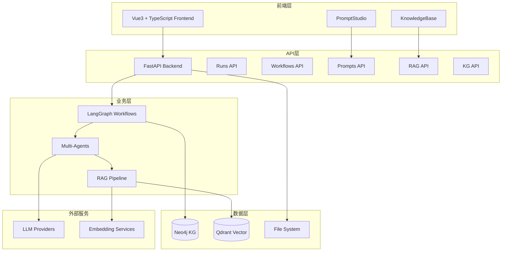
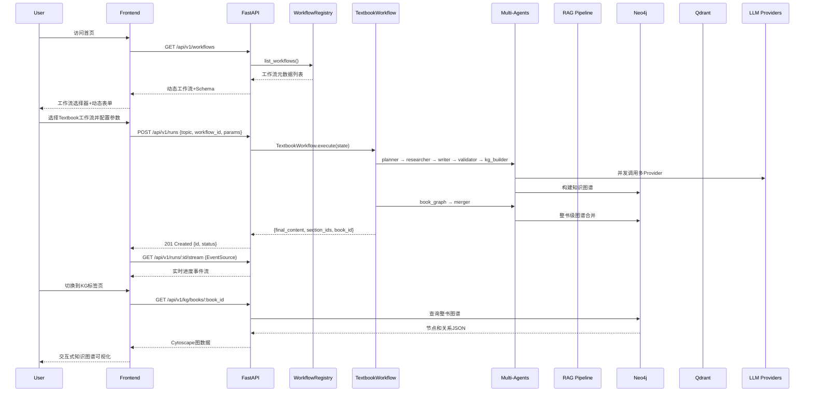
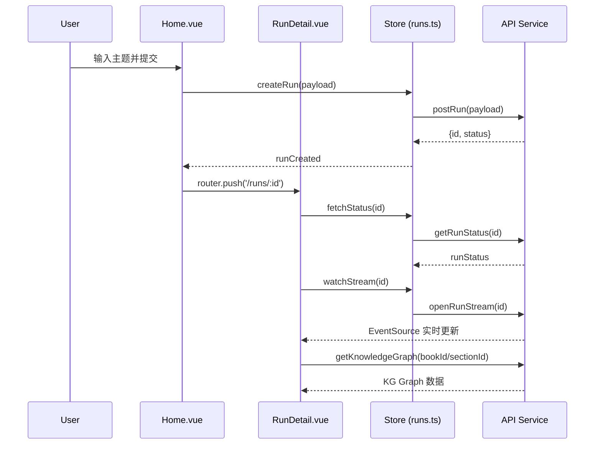

# SOPilot 项目现状说明书

> 目标：让**新接手的开发者**在 1–2 小时内通过本文档了解代码逻辑、模块协作、运行方式与前端形态，并能在 1 天内完成一次小特性或修复。
> 
> **最后更新**: 2025-09-12 - 基于实际架构的完整更新，涵盖RAG+KG双引擎、多工作流、Prompt工程化等所有核心功能。

---

## 0. 快速上手（10 分钟导览）

* **仓库位置 / 分支**：`main` （稳定）
* **一键运行**：`docker compose up -d --build` 或 `pwsh -File scripts/dev.ps1`
* **调试入口**：后端 `python -m uvicorn app.asgi:app --reload --app-dir backend/src --port 8000`，前端 `npm run dev` in frontend/
* **核心路径**：

  * 后端入口：`backend/src/app/main.py`
  * LangGraph 图：`backend/src/app/domain/workflows/textbook/graph.py`
  * 知识图谱：`backend/src/app/infrastructure/graph_store/neo4j_store.py`
  * 前端路由：`frontend/src/router/index.ts`
* **黄金路径（Golden Path）**：

  1. 启动服务 → 2) 打开 `/` → 3) 输入教材主题 → 4) 触发工作流 → 5) 查看运行状态与 KG 可视化
* **示例账号/密钥**：在 `backend/.env` 配置 LLM API Key

### 0.1 详细安装指南

#### 环境准备

**必需环境：**
```bash
# 检查版本
python --version  # >= 3.11
node --version    # >= 20.0
docker --version  # >= 26.0
docker compose version  # v2.x
```

**可选环境：**
```bash
# Python包管理器（推荐）
pip install uv  # 更快的包管理器

# PowerShell（Windows）
winget install Microsoft.PowerShell  # 如果使用 scripts/dev.ps1
```

#### 快速开始（3种方式）

**方式1：Docker Compose（推荐生产）**
```bash
# 1. 克隆仓库
git clone <repository_url>
cd SOPilot

# 2. 配置环境变量
cp backend/.env.example backend/.env
# 编辑 backend/.env 文件，至少配置：
# APP_PROVIDERS__siliconflow__API_KEYS=["your_api_key"]

# 3. 一键启动
docker compose up -d --build

# 4. 验证服务
curl http://localhost:8000/api/v1/runs/health
# 前端访问：http://localhost:5173
```

**方式2：脚本启动（推荐开发）**
```powershell
# Windows PowerShell
pwsh -File scripts/dev.ps1

# 或者分步骤
pwsh -File scripts/dev.ps1 -SkipInstall  # 跳过依赖安装
```

**方式3：手动启动（调试）**
```bash
# 后端
cd backend
pip install -r requirements.txt
export PYTHONPATH=src
python -m uvicorn app.asgi:app --reload --app-dir src --port 8000

# 前端（新终端）
cd frontend  
npm install
npm run dev

# Neo4j（新终端，可选）
docker run --name neo4j -p 7474:7474 -p 7687:7687 \
  -e NEO4J_AUTH=neo4j/test1234 neo4j:5.21.0
```

#### 环境变量配置详解

创建 `backend/.env` 文件：
```bash
# 核心配置
APP_USE_REAL_WORKFLOW=true
APP_OUTPUT_DIR=/app/output

# LLM配置（选择一个提供商）
APP_DEFAULT_PROVIDER=siliconflow
# SiliconFlow
APP_PROVIDERS__siliconflow__BASE_URL=https://api.siliconflow.cn/v1
APP_PROVIDERS__siliconflow__MODEL=Qwen/Qwen3-Coder-30B-A3B-Instruct
APP_PROVIDERS__siliconflow__API_KEYS=["sk-your-api-key"]

# 或 OpenAI
# APP_DEFAULT_PROVIDER=openai
# APP_PROVIDERS__openai__BASE_URL=https://api.openai.com/v1
# APP_PROVIDERS__openai__MODEL=gpt-4o-mini
# APP_PROVIDERS__openai__API_KEYS=["sk-your-openai-key"]

# Neo4j配置
APP_NEO4J__URI=bolt://localhost:7687
APP_NEO4J__USER=neo4j
APP_NEO4J__PASSWORD=test1234
APP_NEO4J__DATABASE=neo4j

# 可选：中间件配置（实际环境变量名称）
APP_MIDDLEWARE__MAX_RETRIES=3
APP_MIDDLEWARE__DEFAULT_TIMEOUT=300
APP_MIDDLEWARE__REQUESTS_PER_MINUTE=60

# 或使用Worker级配置
WRITER_MAX_WORKERS=50
WRITER_TIMEOUT=120
VALIDATOR_PASS_THRESHOLD=7.0
VALIDATOR_MAX_REWRITE_ATTEMPTS=1
```

#### 验证安装

运行健康检查：
```bash
# 后端健康检查
curl http://localhost:8000/api/v1/runs/health
# 期望返回：{"status": "ok"}

# Neo4j连接检查
curl -u neo4j:test1234 http://localhost:7474/db/neo4j/tx/commit \
  -H "Content-Type: application/json" \
  -d '{"statements":[{"statement":"RETURN 1 as test"}]}'

# 前端检查
curl http://localhost:5173
# 或在浏览器打开 http://localhost:5173
```

#### 常见安装问题

**问题1：端口冲突**
```bash
# 检查端口占用
netstat -an | grep ":8000\|:5173\|:7687"
# Windows: netstat -an | findstr ":8000 :5173 :7687"

# 解决方案：修改 docker-compose.yml 中的端口映射
```

**问题2：Neo4j连接失败**
```bash
# 检查Neo4j容器状态
docker logs sopilot-neo4j

# 常见原因：
# 1. 端口被占用 → 修改端口
# 2. 内存不足 → 增加Docker内存限制
# 3. 密码错误 → 检查环境变量
```

**问题3：LLM API调用失败**
```bash
# 检查API密钥
# 1. 确认密钥格式正确（JSON数组）
# 2. 确认密钥有效且有余额
# 3. 检查网络连接和代理设置
```

---

## 1. 系统总览

### 1.1 一句话说明

本项目是一个基于 **LangGraph + FastAPI + Vue3 + Neo4j + Qdrant 的现代化AI教材生成平台**，集成RAG检索增强、多工作流编排、Prompt工程化管理，支持智能教材创作、知识图谱构建与可视化。

#### 技术栈详细版本

**后端技术栈：**
- **FastAPI 0.115.2**：现代化Python Web框架，RESTful API + OpenAPI文档
- **Uvicorn 0.30.6**：ASGI服务器，支持异步和高性能
- **Pydantic 2.9.2**：数据验证和序列化，严格类型安全
- **LangGraph (latest)**：工作流编排引擎，支持复杂的多智能体协作和状态管理
- **LangChain Core + OpenAI**：LLM抽象层，多Provider统一接口
- **Neo4j 5.23.1**：图数据库驱动，知识图谱存储与查询
- **Qdrant Client 1.7.0+**：向量数据库客户端，语义检索
- **HTTPx 0.27.2**：异步HTTP客户端，支持并发调用
- **Jinja2 3.1.4**：模板引擎，Prompt动态渲染
- **PyYAML 6.0.2**：YAML解析，配置文件管理

**前端技术栈：**
- **Vue 3.4.0**：组合式API，响应式框架
- **TypeScript 5.5.4**：类型安全的JavaScript超集
- **Vite 5.4.0**：下一代前端构建工具，HMR支持
- **Vue Router 4.3.0**：官方路由解决方案
- **Pinia 2.1.7**：Vue状态管理，Vuex的继任者
- **Axios 1.7.2**：HTTP客户端，Promise based
- **Cytoscape 3.33.1**：图可视化库，用于知识图谱展示

**基础设施：**
- **Docker + Docker Compose**：容器化编排部署
- **Neo4j 5.21.0**：图数据库服务，支持Cypher查询
- **Qdrant (latest)**：向量数据库服务，支持高性能向量检索
- **PowerShell Core**：跨平台自动化脚本和开发工具


### 1.2 架构图（简版）

> 可先用文字/表格描述，或粘贴架构图链接；若用 Mermaid：


```mermaid
flowchart TB
  subgraph "前端层"
    UI[Vue3 + TypeScript Frontend]
    PS[PromptStudio]
    KB[KnowledgeBase]
  end
  
  subgraph "API层"
    API[FastAPI Backend]
    RUNS[Runs API]
    WFS[Workflows API]
    PRMT[Prompts API]
    RAG[RAG API]
    KG[KG API]
  end
  
  subgraph "业务层"
    WF[LangGraph Workflows]
    AGT[Multi-Agents]
    RG[RAG Pipeline]
  end
  
  subgraph "数据层"
    NEO[(Neo4j KG)]
    QDR[(Qdrant Vector)]
    FS[File System]
  end
  
  subgraph "外部服务"
    LLM[LLM Providers]
    EMB[Embedding Services]
  end

  UI --> API
  PS --> PRMT
  KB --> RAG
  API --> WF
  WF --> AGT
  AGT --> RG
  RG --> QDR
  WF --> NEO
  AGT --> LLM
  RG --> EMB
  API --> FS
```

### 1.3 运行形态 & 部署

* 本地：`Python 3.11+`、`Node.js 20+`、`Neo4j 5.21+`、`Docker 26+`
* 服务器：Docker Compose 编排部署
* 端口占用表：

  | 服务 | 端口 | 说明 |
  | ---- | ---- | ---- |
  | Frontend | 5173 | Vite Dev Server / SPA |
  | Backend | 8000 | FastAPI + Auto OpenAPI Docs |
  | Neo4j | 7474/7687 | Web Console / Bolt Protocol |
  | Qdrant | 6333/6334 | Vector DB API / gRPC |

---

## 2. 代码结构 & 约定

### 2.1 目录树（精简）

```
SOPilot/
├── backend/
│   └── src/app/
│       ├── main.py              # FastAPI 应用入口
│       ├── asgi.py              # ASGI 入口
│       ├── api/v1/              # RESTful API路由
│       │   ├── router.py        # API路由聚合器
│       │   ├── runs.py          # 运行管理API
│       │   ├── workflows.py     # 工作流API
│       │   ├── prompts.py       # Prompt管理API
│       │   ├── rag.py           # RAG检索API
│       │   └── kg.py            # 知识图谱API
│       ├── core/                # 核心基础设施
│       │   ├── settings.py      # 分层配置管理
│       │   ├── logging.py       # 结构化日志
│       │   ├── lifecycle.py     # 应用生命周期
│       │   ├── concurrency.py   # 并发控制
│       │   └── progress_manager.py # 实时进度管理
│       ├── domain/              # 领域驱动设计层
│       │   ├── workflows/       # 多工作流编排
│       │   │   ├── registry.py  # 工作流注册中心
│       │   │   ├── textbook/    # 教材生成工作流
│       │   │   └── quiz_maker/  # 问答生成工作流
│       │   ├── agents/          # 智能体实现
│       │   │   ├── planner.py   # 规划智能体
│       │   │   ├── researcher.py # 研究智能体
│       │   │   ├── writer.py    # 写作智能体
│       │   │   └── validator.py # 验证智能体
│       │   ├── kg/              # 知识图谱引擎
│       │   │   ├── pipeline.py  # KG构建流水线
│       │   │   ├── builder.py   # 实体关系抽取
│       │   │   └── service.py   # KG查询服务
│       │   ├── prompts/         # Prompt模板管理
│       │   └── state/           # 状态定义
│       ├── infrastructure/      # 基础设施层
│       │   ├── llm/             # LLM路由与适配
│       │   │   ├── router/      # 多Provider路由
│       │   │   └── providers/   # Provider实现
│       │   ├── rag/             # RAG检索引擎
│       │   │   ├── pipeline.py  # RAG主管线
│       │   │   ├── vectorstores/ # 向量存储
│       │   │   ├── kgstores/    # KG存储
│       │   │   ├── retrievers/  # 检索器
│       │   │   └── rerankers/   # 重排器
│       │   ├── graph_store/     # 图数据库
│       │   └── storage/         # 文件存储
│       └── services/            # 服务层
│           ├── workflow_service.py # 工作流服务
│           ├── prompt_service.py   # Prompt服务
│           └── llm_service.py      # LLM服务
├── frontend/
│   └── src/
│       ├── main.ts              # Vue3 + TypeScript入口
│       ├── App.vue              # 根组件(现代化导航)
│       ├── router/index.ts      # Vue Router配置
│       ├── views/               # 页面组件
│       │   ├── Home.vue         # 工作流选择页面
│       │   ├── RunDetail.vue    # 运行详情页面
│       │   ├── PromptStudio.vue # Prompt编辑器
│       │   └── KnowledgeBase.vue # 知识库管理
│       ├── components/          # 可复用组件
│       │   ├── RunConsole.vue   # 运行控制台
│       │   └── KgGraph.vue      # 知识图谱可视化
│       ├── store/               # Pinia状态管理
│       │   └── runs.ts          # 运行状态Store
│       └── services/api.ts      # API客户端封装
├── docker-compose.yml           # 容器编排配置
├── knowledge_base/              # RAG知识库目录
│   ├── chunks/                  # 分块存储
│   ├── raw/                     # 原始文档
│   └── snapshots/               # 快照备份
├── output/                      # 运行产物输出
└── scripts/dev.ps1              # 开发自动化脚本
```

### 2.2 命名与风格

* Python：PEP8；函数/类使用 snake_case/PascalCase；Pydantic 模型用于数据验证
* 前端：Vue3 + `<script setup>` TypeScript；组件命名 `PascalCase`；文件名 `kebab-case`

---

## 3. 模块协作 & 运行链路（**核心**）

> 本节要让读者看懂**一次功能调用从前端到后端、再到工作流/RAG/KG的全链路**。

### 3.1 功能用例清单（业务视角）

| 用例 | 入口页面 | 主要交互 | 后端路由 | 工作流/服务 | 产出 |
| ---- | -------- | -------- | -------- | ----------- | ---- |
| 教材生成 | `/` | 选择工作流→动态表单→创建 | `POST /api/v1/runs` | `TextbookWorkflow` | 教材内容、KG节点、运行状态 |
| 问答生成 | `/` | 选择Quiz工作流→配置参数 | `POST /api/v1/runs` | `QuizMakerWorkflow` | 问答内容、格式化输出 |
| 运行监控 | `/runs/:id` | 实时状态/EventSource流 | `GET /api/v1/runs/:id/stream` | `workflow_service` | 实时进度与流式日志 |
| KG可视化 | `/runs/:id` | 图谱交互/节点展开 | `GET /api/v1/kg/books/:id` | `kg_service` | 整书图谱JSON数据 |
| Prompt管理 | `/prompts` | 编辑/保存/验证Prompt | `PUT /api/v1/prompts/:id` | `prompt_service` | YAML模板文件 |
| 知识库管理 | `/knowledge` | 文档上传/索引/RAG测试 | `POST /api/v1/rag/documents` | `rag_service` | 向量索引、检索结果 |
| 工作流发现 | `/` | 动态工作流列表 | `GET /api/v1/workflows` | `WorkflowRegistry` | 工作流元数据+Schema |

### 3.2 端到端时序（示例）


```mermaid
sequenceDiagram
  participant U as User
  participant FE as Frontend
  participant API as FastAPI
  participant REG as WorkflowRegistry
  participant WF as TextbookWorkflow
  participant AGT as Multi-Agents
  participant RAG as RAG Pipeline
  participant NEO as Neo4j
  participant QDR as Qdrant
  participant LLM as LLM Providers

  U->>FE: 访问首页
  FE->>API: GET /api/v1/workflows
  API->>REG: list_workflows()
  REG-->>API: 工作流元数据列表
  API-->>FE: 动态工作流+Schema
  FE-->>U: 工作流选择器+动态表单
  
  U->>FE: 选择Textbook工作流并配置参数
  FE->>API: POST /api/v1/runs {topic, workflow_id, params}
  API->>WF: TextbookWorkflow.execute(state)
  WF->>AGT: planner → researcher → writer → validator → kg_builder
  AGT->>LLM: 并发调用多Provider
  AGT->>NEO: 构建知识图谱
  WF->>AGT: book_graph → merger
  AGT->>NEO: 整书级图谱合并
  WF-->>API: {final_content, section_ids, book_id}
  API-->>FE: 201 Created {id, status}
  
  FE->>API: GET /api/v1/runs/:id/stream (EventSource)
  API-->>FE: 实时进度事件流
  
  U->>FE: 切换到KG标签页
  FE->>API: GET /api/v1/kg/books/:book_id
  API->>NEO: 查询整书图谱
  NEO-->>API: 节点和关系JSON
  API-->>FE: Cytoscape图数据
  FE-->>U: 交互式知识图谱可视化
```

### 3.3 LangGraph 图 & 节点契约

* **图文件**：`backend/src/app/domain/workflows/textbook/graph.py`

* **节点列表**：

  | 节点 | 输入 State | 输出 State | 说明 |
  | ---- | ---------- | ---------- | ---- |
  | planner | {topic, language, chapter_count} | {outline, chapters} | 生成教材大纲和章节结构 |
  | researcher | {chapters} | {research_content, keywords_map} | 并发研究子章节，生成关键词与摘要 |
  | writer | {chapters, research_content} | {content, validation_results} | 并发写作与验证，闭环迭代 |
  | qa_generator | {content} | {qa_results, qa_content} | 为通过验证的内容生成问答对 |
  | kg_builder | {content} | {knowledge_graphs, section_ids} | 构建小节级知识图谱 |
  | book_graph | {knowledge_graphs} | {book_id} | 构建整本书知识图谱视图 |
  | merger | {content, qa_content} | {final_content} | 编排并合成最终教材 |

* **State 模式**：

  ```py
  class TextbookState(TypedDict, total=False):
      topic: str
      language: str
      chapter_count: int
      outline: Optional[str]
      chapters: Optional[List[Dict[str, Any]]]
      research_content: Optional[Dict[str, str]]
      content: Optional[Dict[str, str]]
      qa_results: Optional[Dict[str, Dict[str, Any]]]
      knowledge_graphs: Optional[Dict[str, Dict[str, Any]]]
      final_content: Optional[str]
      section_ids: Optional[List[str]]
      book_id: Optional[str]
  ```

#### 3.3.1 节点实现详解

**1. Planner Node（规划节点）**
- **文件位置**：`backend/src/app/domain/workflows/textbook/nodes/planner_node.py`
- **核心智能体**：`app.domain.agents.planner.Planner`
- **功能**：根据主题、语言、章节数生成教材大纲
- **并发处理**：无（单一规划任务）
- **错误处理**：异常捕获并在state中记录错误信息
- **产出**：
  ```json
  {
    "outline": "教材总体大纲文本",
    "chapters": [
      {
        "title": "章节标题",
        "subchapters": [
          {"title": "子章节标题", "description": "简介"}
        ]
      }
    ]
  }
  ```

**2. Researcher Node（研究节点）**
- **文件位置**：`backend/src/app/domain/workflows/textbook/nodes/researcher_node.py`
- **核心智能体**：`app.domain.agents.researcher.Researcher`
- **功能**：为每个子章节生成研究内容和关键词
- **并发处理**：支持（可配置max_workers）
- **特点**：
  - 生成子章节的背景研究内容
  - 提取关键词用于后续KG构建
  - 为写作节点提供参考资料
- **产出**：
  ```json
  {
    "research_content": {
      "子章节标题": "研究内容文本"
    },
    "subchapter_keywords_map": {
      "子章节标题": ["关键词1", "关键词2"]
    }
  }
  ```

**3. Writer Node（写作节点）**
- **文件位置**：`backend/src/app/domain/workflows/textbook/nodes/writer_node.py`
- **核心智能体**：`Writer`、`Validator`、`QAGenerator`
- **功能**：并发写作子章节内容并进行质量验证
- **并发处理**：支持（ThreadPoolExecutor）
- **验证机制**：
  - 写作完成后自动调用Validator验证
  - 不通过则重写（可配置最大重试次数）
  - 通过验证的内容自动生成QA
- **配置项**：
  ```python
  max_workers = concurrency_config["writer"]["max_workers"]
  max_rewrite_attempts = concurrency_config["validator"]["max_rewrite_attempts"]
  ```
- **产出**：
  ```json
  {
    "content": {"子章节标题": "章节内容"},
    "validation_results": {
      "子章节标题": {
        "is_passed": true,
        "score": 8.5,
        "feedback": "质量评估反馈"
      }
    },
    "qa_content": {"子章节标题": "QA内容"},
    "qa_metadata": {"子章节标题": {...}}
  }
  ```

**4. QA Generator Node（问答生成节点）**
- **文件位置**：`backend/src/app/domain/workflows/textbook/nodes/qa_node.py`
- **功能**：为缺失QA的内容补充问答对
- **触发条件**：writer节点未生成QA或QA质量不达标
- **并发处理**：支持
- **产出**：补充缺失的qa_results和qa_content

**5. KG Builder Node（知识图谱构建节点）**
- **文件位置**：`backend/src/app/domain/workflows/textbook/nodes/kg_node.py`
- **核心模块**：`KGPipeline`、`KGMerger`
- **功能**：为通过验证的子章节构建知识图谱
- **处理流程**：
  1. 筛选验证通过的子章节
  2. 并发为每个子章节构建KG
  3. 生成唯一的section_id
  4. 存储到Neo4j数据库
- **并发配置**：`kg_builder.max_workers`
- **产出**：
  ```json
  {
    "knowledge_graphs": {
      "子章节标题": {"nodes": [...], "edges": [...]}
    },
    "section_ids": ["section_1", "section_2"]
  }
  ```

**6. Book Graph Node（整书图谱节点）**
- **文件位置**：`backend/src/app/domain/workflows/textbook/nodes/book_graph_node.py`
- **功能**：将各小节KG合并为整本书的知识图谱（B1方案实现）
- **核心机制**：
  - **多Scope支持**：区分section级和book级图谱
  - **幂等写入**：使用rid（关系ID）确保数据一致性
  - **替换模式**：按scope删除旧数据再插入新数据
- **处理流程**：
  1. 收集所有通过验证的section_ids的KG数据
  2. 生成唯一book_id：`book:{topic}:{8位时间戳}`
  3. 为每条边添加完整属性：
     ```json
     {
       "source_id": "源节点ID",
       "target_id": "目标节点ID",
       "scope": "book:topic:timestamp",  // 整本书范围
       "src": "section_id",              // 来源小节
       "rid": "relation_unique_id",      // 关系唯一ID
       "type": "关系类型"
     }
     ```
  4. 删除现有book scope的关系（幂等性保证）
  5. 批量写入整本书的图谱关系
- **产出**：
  ```json
  {
    "book_id": "book:python_basics:0d24a9b7",
    "nodes_written": 22,
    "edges_written": 46,
    "success": true
  }
  ```

**7. Merger Node（合并节点）**
- **文件位置**：`backend/src/app/domain/workflows/textbook/nodes/merger_node.py`
- **核心模块**：`app.domain.workflows.textbook.merger.Merger`
- **功能**：将所有内容合并为最终教材
- **合并内容**：
  - 教材正文内容
  - QA问答部分
  - 章节结构和目录
- **产出**：
  ```json
  {
    "final_content": "完整的教材Markdown内容"
  }
  ```

#### 3.3.2 并发配置

工作流支持细粒度的并发控制，配置文件：`backend/src/app/core/concurrency.py`

```python
{
  "writer": {"max_workers": 50, "timeout": 120, "retry_count": 3},
  "validator": {"max_rewrite_attempts": 1, "pass_threshold": 7.0},
  "kg_builder": {"max_workers": 50, "timeout": 120, "retry_count": 3},
  "qa_generator": {"max_workers": 50, "timeout": 120, "retry_count": 3},
  "researcher": {"max_workers": 50, "timeout": 120, "retry_count": 3}
}
```

#### 3.3.3 错误处理策略

每个节点都实现了统一的错误处理模式：
1. **异常捕获**：捕获所有异常并记录日志
2. **状态传播**：在state中添加error字段
3. **优雅降级**：错误状态下跳过后续节点
4. **错误恢复**：支持从断点继续执行（LangGraph checkpointer）

### 3.4 RAG 管道（双通道架构）

本项目实现了完整的RAG检索增强生成管道，采用双通道并行检索架构。

#### 3.4.1 RAG架构设计

**核心组件**：
- **DocumentChunker**: 文档分块处理（800字/块，120字重叠）
- **Embedder**: API化嵌入服务（硅基流动等Provider）
- **QdrantStore**: 向量数据库接口
- **Neo4jKGQueries**: 知识图谱查询
- **VectorRetriever**: 向量检索器（语义召回）
- **KGRetriever**: KG检索器（结构关系）
- **EvidenceMerger**: 证据智能合并重排
- **BGEReranker**: API化重排器（可选）
- **PromptBuilder**: RAG Prompt构造器

#### 3.4.2 双通道检索流程

```python
async def dual_channel_retrieve(self, query: str) -> RAGResult:
    # 1. 并行执行向量检索和KG检索
    vector_task = self.vector_retriever.search(query, top_k=12)
    kg_task = self.kg_retriever.search(query, top_k=8, hop=2)
    
    vector_hits, kg_hits = await asyncio.gather(vector_task, kg_task)
    
    # 2. 智能合并重排 (alpha=0.7向量权重, beta=0.3KG权重)
    merged = self.evidence_merger.merge(vector_hits, kg_hits)
    
    # 3. 可选重排
    if self.config.use_reranker:
        reranked = self.reranker.rerank(query, merged, top_k=4)
    
    # 4. 构造RAG Prompt
    prompt = self.prompt_builder.build(query, merged)
    return RAGResult(vector_hits, kg_hits, merged, prompt)
```

#### 3.4.3 关键函数与接口

* **文档索引**: `pipeline.index_documents()` - 支持PDF/TXT/MD等格式
* **双通道检索**: `pipeline.retrieve()` - 统一检索入口  
* **测试接口**: `pipeline.test_retrieval()` - RAG调试和评估
* **向量库**: Qdrant - 高性能向量检索，支持余弦相似度
* **图数据库**: Neo4j - 结构化关系检索，支持多跳查询

### 3.5 知识图谱（Neo4j）模型

#### 3.5.1 数据模型设计

**节点类型定义：**
- **ChapterNode**：章节节点，表示教材的主要章节
- **SubchapterNode**：子章节节点，章节下的具体小节
- **ConceptNode**：概念节点，知识点、算法、实体等

**节点属性结构：**
```json
{
  "id": "unique_identifier",          // 全局唯一ID
  "type": "concept|chapter|subchapter", // 节点类型
  "name": "节点名称",                   // 显示名称
  "description": "节点描述",            // 详细描述
  "properties": {...},                // 扩展属性
  "created_at": "2024-01-01T00:00:00Z", // 创建时间
  "updated_at": "2024-01-01T00:00:00Z"  // 更新时间
}
```

**关系属性结构：**
```json
{
  "source_id": "源节点ID",
  "target_id": "目标节点ID", 
  "type": "关系类型",
  "src": "section_id",              // 来源小节ID
  "scope": "book_id",               // 所属书籍ID
  "weight": 0.8,                    // 关系权重（可选）
  "properties": {...},              // 扩展属性
  "created_at": "2024-01-01T00:00:00Z"
}
```

#### 3.5.2 数据组织策略

**多Scope分层存储（B1方案核心）：**
1. **Section Scope**：`section_id` - 小节级图谱
   - 存储单个小节的知识结构
   - 快速查询特定小节内容
   - 支持增量构建和更新
2. **Book Scope**：`book:{topic}:{timestamp}` - 整本书级图谱
   - 合并所有小节的知识结构
   - 提供完整的书籍知识视图
   - 支持跨章节知识关联分析
3. **节点共享**：相同概念的节点在不同scope间复用

**幂等性保证机制：**
- **RID（关系ID）**：每条关系的唯一标识符
- **替换模式**：按scope删除旧关系再插入新关系
- **内容哈希**：基于节点内容生成唯一ID避免重复

**查询优化策略：**
- 为 `section_id`、`scope`、`rid` 创建复合索引
- 前端优先查询Book Scope，回退到Section Scope
- 支持按层次和关系类型的多维度查询

#### 3.5.3 Cypher 查询示例

**节点创建/更新：**
  ```cypher
MERGE (n:ConceptNode {id: $id})
SET n += $properties
SET n.updated_at = datetime()
RETURN n.id as node_id
```

**关系创建：**
```cypher
MATCH (source {id: $source_id}), (target {id: $target_id})
MERGE (source)-[r:RELATES_TO]->(target)
SET r += $properties
SET r.created_at = datetime()
RETURN r
```

**小节图谱查询：**
```cypher
MATCH ()-[r]->() WHERE r.src = $section_id
RETURN properties(r) AS edge

MATCH ()-[r]->() WHERE r.src = $section_id
WITH collect(DISTINCT r.source_id) + collect(DISTINCT r.target_id) AS ids
UNWIND ids AS nid MATCH (n {id: nid})
RETURN DISTINCT properties(n) AS node
```

**整书图谱查询：**
```cypher
MATCH ()-[r]->() WHERE r.scope = $scope
RETURN properties(r) AS edge
```

#### 3.5.4 数据一致性保证

**替换模式：**
- 按 `section_id` 删除旧关系再插入新关系
- 避免数据重复和不一致

**幂等性：**
- 使用 `MERGE` 操作确保节点唯一性
- 基于 `content_hash` 的增量更新

**事务处理：**
- 批量操作使用事务保证原子性
- 异常情况下自动回滚

---

## 4. API 合同（Contract-First）

> 前后端联调以此为准（**路径、方法、参数、响应、错误码**）。

### 4.1 创建运行

* **POST** `/api/v1/runs`
* **Body**

  ```json
  {
    "topic": "大型语言模型与知识图谱",
    "language": "中文",
    "chapter_count": 3
  }
  ```
* **201 响应**

  ```json
  {
    "id": "run_12345678",
    "status": "created"
  }
  ```
* **错误码**：`400` 参数错误；`500` 内部错误

### 4.2 获取运行状态

* **GET** `/api/v1/runs/{run_id}`
* **200 响应**：

  ```json
  {
    "id": "run_12345678",
    "status": "completed",
    "result": {
      "final_content": "...",
      "section_ids": ["section_1", "section_2"],
      "book_id": "book:python_basics:12345678"
    },
    "updated_at": 1640995200
  }
  ```

### 4.2.1 工作流发现

* **GET** `/api/v1/workflows`
* **200 响应**：

  ```json
  [
    {
      "id": "textbook",
      "name": "教材生成工作流",
      "description": "智能生成结构化教材内容",
      "version": "1.0.0",
      "tags": ["教育", "内容生成"],
      "input_schema": {
        "type": "object",
        "properties": {
          "topic": {"type": "string", "title": "主题"},
          "chapter_count": {"type": "integer", "minimum": 1, "maximum": 20}
        },
        "required": ["topic", "chapter_count"]
      },
      "ui_schema": {
        "chapter_count": {"ui:widget": "range"}
      }
    }
  ]
  ```

### 4.2.2 Prompt管理

* **GET** `/api/v1/prompts` - 获取Prompt列表
* **GET** `/api/v1/prompts/{prompt_id}` - 获取Prompt详情
* **PUT** `/api/v1/prompts/{prompt_id}` - 更新Prompt内容
* **POST** `/api/v1/prompts/validate` - 验证Prompt语法

### 4.2.3 RAG管理

* **POST** `/api/v1/rag/documents` - 上传并索引文档
* **GET** `/api/v1/rag/documents` - 获取文档列表  
* **DELETE** `/api/v1/rag/documents/{doc_name}` - 删除文档
* **POST** `/api/v1/rag/reindex` - 重建向量索引
* **POST** `/api/v1/rag/test` - RAG检索测试

### 4.3 流式监控

* **GET** `/api/v1/runs/{run_id}/stream`
* **EventSource 响应**：实时进度事件流

### 4.4 知识图谱查询

* **GET** `/api/v1/kg/sections/{section_id}`
* **GET** `/api/v1/kg/books/{book_id}`
* **200 响应**：

  ```json
  {
    "nodes": [{"id": "node1", "type": "concept", "properties": {...}}],
    "edges": [{"source": "node1", "target": "node2", "type": "relates_to"}]
  }
  ```

> 其余接口请逐条列出。建议生成 `openapi.json` 并在前端用 `swagger-ui`/`Redoc` 内嵌。

---

## 5. 前端形态（**直观看到“长什么样”**）

### 5.1 路由表

| 路由 | 页面 | 权限 | 说明 |
| ---- | ---- | ---- | ---- |
| `/` | Home.vue | 无 | 工作流选择和动态表单创建 |
| `/runs/:id` | RunDetail.vue | 无 | 运行详情、KG可视化、产物管理 |
| `/prompts` | PromptStudio.vue | 无 | YAML Prompt编辑器和管理 |
| `/knowledge` | KnowledgeBase.vue | 无 | 文档管理、RAG测试、知识库调试 |

### 5.2 组件树

```
App.vue (现代化导航栏 + 路由容器)
├─ router-view
│  ├─ Home.vue (/)
│  │  ├─ 工作流选择器 (动态工作流卡片)
│  │  └─ 动态表单 (基于JSON Schema)
│  ├─ RunDetail.vue (/runs/:id)
│  │  ├─ 标签页导航 (Overview/KG/Artifacts)
│  │  ├─ RunConsole.vue (实时日志显示)
│  │  └─ KgGraph.vue (Cytoscape知识图谱)
│  ├─ PromptStudio.vue (/prompts)
│  │  ├─ 三栏布局 (列表/编辑器/预览)
│  │  ├─ YAML编辑器 (Monaco Editor)
│  │  └─ 语法验证 (实时校验)
│  └─ KnowledgeBase.vue (/knowledge)
│     ├─ 文档管理面板 (上传/列表/删除)
│     ├─ RAG调试面板 (检索测试)
│     └─ 索引状态监控 (向量化进度)
```

### 5.3 交互流程（页面级时序）


```mermaid
sequenceDiagram
  participant U as User
  participant H as Home.vue
  participant R as RunDetail.vue
  participant S as Store (runs.ts)
  participant API as API Service

  U->>H: 输入主题并提交
  H->>S: createRun(payload)
  S->>API: postRun(payload)
  API-->>S: {id, status}
  S-->>H: runCreated
  H->>R: router.push('/runs/:id')
  R->>S: fetchStatus(id)
  S->>API: getRunStatus(id)
  API-->>S: runStatus
  R->>S: watchStream(id)
  S->>API: openRunStream(id)
  API-->>R: EventSource 实时更新
  R->>API: getKnowledgeGraph(bookId/sectionId)
  API-->>R: KG Graph 数据
```

### 5.4 视觉与状态

* 设计约束：暗色主题、最小化设计、响应式布局
* 全局状态：Pinia Store (`runs.ts`) 管理运行状态、日志、KG数据
* 错误可视化：控制台错误显示、状态码提示

#### 5.4.1 前端状态管理详解

**Pinia Store 结构 (`frontend/src/store/runs.ts`)：**
```typescript
interface RunState {
  currentId: string | null       // 当前运行ID
  status: RunStatus | null       // 当前运行状态
  logs: string[]                 // 实时日志数组
}

interface RunStatus {
  id: string
  status: 'created' | 'running' | 'completed' | 'failed'
  result?: {
    final_content?: string
    section_ids?: string[]
    book_id?: string
  }
  error?: string
  updated_at?: number
}
```

**核心 Actions：**
- `createRun(payload)`: 创建新的教材生成运行并自动开启流式监听
- `fetchStatus(runId)`: 获取运行状态
- `watchStream(runId)`: 开启EventSource实时监听，自动处理log和end事件

**状态流转：**
```
创建运行 → 获取状态 → 开启流式监听 → 实时更新 → 完成/错误
```

#### 5.4.2 组件实现详解

**KgGraph.vue（知识图谱可视化）：**
- **依赖**：Cytoscape.js 3.33.1
- **功能**：
  - **双模式支持**：整本书图谱（优先）+ 小节图谱（备选）
  - **智能数据源选择**：实现B1方案的前端逻辑
  - 自动布局算法（cola、cose等）
  - 节点/边的交互操作
  - 响应式容器大小调整
- **核心逻辑**：
  ```typescript
  interface KgGraphProps {
    bookId?: string     // 整本书ID，优先使用
    sectionId?: string  // 小节ID，备选方案
  }
  
  // B1方案：优先级数据获取策略
  const loadGraph = async () => {
    try {
      if (bookId) {
        // 优先使用整本书图谱（B1方案核心）
        const data = await getKnowledgeGraph(bookId, null)
        setTitle("整本书知识图谱")
        renderCytoscape(data)
      } else if (sectionId) {
        // 备选：使用小节图谱
        const data = await getKnowledgeGraph(null, sectionId)
        setTitle("小节知识图谱")
        renderCytoscape(data)
      } else {
        showEmptyState()
      }
    } catch (error) {
      showErrorState(error)
    }
  }
  ```
- **视觉区分**：
  - 整本书图谱：显示完整的跨章节知识结构
  - 小节图谱：显示局部的知识点关联

**RunConsole.vue（运行控制台）：**
- **功能**：
  - 实时日志流展示
  - 自动滚动到底部
  - 时间戳格式化
  - 日志级别颜色区分
- **响应式设计**：
  ```vue
  <template>
    <div class="console">
      <div v-for="log in logs" :key="log.id" class="log-entry">
        {{ formatTimestamp(log.timestamp) }} {{ log.message }}
      </div>
    </div>
  </template>
  ```

#### 5.4.3 样式系统

**设计令牌（CSS Variables）：**
```css
:root {
  --color-bg-primary: #0e0f12;      /* 主背景色 */
  --color-bg-secondary: #1a1b1e;    /* 次要背景色 */
  --color-text-primary: #ffffff;     /* 主文本色 */
  --color-text-secondary: #999999;   /* 次要文本色 */
  --color-accent: #66fcf1;          /* 强调色 */
  --color-border: #333333;          /* 边框色 */
  --color-error: #ff6b6b;           /* 错误色 */
  --color-success: #51cf66;         /* 成功色 */
}
```

**响应式断点：**
```css
/* Mobile */
@media (max-width: 768px) { ... }
/* Tablet */
@media (min-width: 769px) and (max-width: 1024px) { ... }
/* Desktop */
@media (min-width: 1025px) { ... }
```

**组件样式约定：**
- 使用 `scoped` 样式避免污染
- 原子化CSS类命名（`.btn`, `.card`, `.form-group`）
- 深色优先的颜色方案

> 若已有界面截图，请在本节粘贴或链接到 `/docs/ui/` 目录。

---

## 6. 配置、密钥与环境

* `.env.example` 字段表

  | 键 | 示例值 | 说明 |
  | -- | ------ | ---- |
  | APP_USE_REAL_WORKFLOW | true | 是否使用真实工作流 |
  | APP_DEFAULT_PROVIDER | siliconflow | 默认LLM提供商 |
  | APP_PROVIDERS__siliconflow__BASE_URL | https://api.siliconflow.cn/v1 | LLM API基础URL |
  | APP_PROVIDERS__siliconflow__MODEL | Qwen/Qwen3-Coder-30B-A3B-Instruct | LLM模型名称 |
  | APP_PROVIDERS__siliconflow__API_KEYS | ["sk-xxx"] | LLM API密钥列表 |
  | APP_NEO4J__URI | bolt://neo4j:7687 | Neo4j连接URI |
  | APP_NEO4J__USER | neo4j | Neo4j用户名 |
  | APP_NEO4J__PASSWORD | test1234 | Neo4j密码 |
  | APP_QDRANT__URL | http://qdrant:6333 | Qdrant向量数据库URL |
  | APP_QDRANT__COLLECTION | kb_chunks | 向量集合名称 |
  | APP_QDRANT__DISTANCE | cosine | 向量距离算法 |
  | APP_OUTPUT_DIR | /app/output | 运行产物输出目录 |
  | APP_MIDDLEWARE__MAX_RETRIES | 3 | LLM调用最大重试次数 |
  | APP_MIDDLEWARE__REQUESTS_PER_MINUTE | 60 | 限流配置 |
* 多环境配置：支持 `APP_*` 前缀环境变量覆盖，嵌套使用 `__` 分隔符
* Pydantic Settings：自动类型验证和配置分层管理

---

## 7. 数据与存储

### 7.1 存储架构

* **运行产物**: `./output/<run_id>/` 目录，包含状态JSON、最终内容MD、KG section IDs、ZIP打包
* **向量数据库**: Qdrant存储文档块向量，支持余弦相似度检索，集合名 `kb_chunks`
* **知识图谱**: Neo4j存储节点和关系，支持多Scope（section/book级别）组织
* **知识库文档**: `./knowledge_base/` 目录，包含原始文档、分块数据、索引快照
* **Prompt模板**: `domain/prompts/` YAML文件，支持Git版本控制和热更新
* **配置文件**: 分层配置管理，支持环境变量覆盖和类型验证

### 7.2 数据生命周期

```
创建运行 → 工作流执行 → 多智能体协作 → KG构建 → 
向量索引 → 产物落盘 → 可视化查询 → 下载/分享
```

### 7.3 存储优化

* **增量更新**: 支持文档增量索引和KG增量构建
* **幂等性**: 基于content_hash的去重机制
* **备份策略**: 自动快照和数据持久化
* **查询优化**: 索引优化和分页查询

---

## 8. 测试、质量与可观测性

### 8.1 测试策略

* **单元测试**: 核心算法和工具函数的单元测试
* **集成测试**: API端点和工作流的集成测试
* **端到端测试**: 完整业务流程的E2E测试
* **性能测试**: 并发处理和大文档处理的性能测试
* **RAG评估**: 检索质量和准确性评估

### 8.2 质量保证

* **代码质量**: Python PEP8、TypeScript ESLint、自动格式化
* **类型安全**: Pydantic模型验证、TypeScript严格类型检查
* **错误处理**: 统一异常处理、优雅降级、错误恢复
* **并发控制**: 动态并发调整、背压控制、超时处理

### 8.3 可观测性

* **结构化日志**: 分级日志、请求追踪、性能指标
* **实时监控**: EventSource进度流、状态变更通知
* **健康检查**: 服务健康检查、数据库连接状态
* **性能监控**: 响应时间、资源使用、错误率统计
* **业务指标**: 运行成功率、KG质量评分、用户满意度

---

## 8.1 端到端业务流与状态机

### Run全生命周期状态机

**状态转换流程：**
```
created → pending → running → succeeded/failed/cancelled
```

**状态定义与进入条件：**

| 状态 | 进入条件 | 可观测字段 | 退出条件 | 失败回退策略 |
|------|----------|------------|----------|------------|
| `created` | 用户提交POST请求 | `created_at`, `topic`, `chapter_count` | 工作流启动 | 立即失败 |
| `pending` | Run创建成功 | `id`, `status`, `updated_at` | 工作流开始执行 | 标记失败 |
| `running` | 工作流开始执行 | 进度事件、节点状态、实时日志 | 工作流完成/异常 | 保留中间产物，可从断点恢复 |
| `succeeded` | 所有节点成功完成 | `final_content`, `section_ids`, `book_id` | 终态 | N/A |
| `failed` | 任意节点异常终止 | `error` 消息、失败节点信息 | 终态 | 保留已生成内容 |
| `cancelled` | 用户主动取消 | `cancelled_at`, 取消原因 | 终态 | 保留已生成内容 |

**取消/超时/重入语义：**

- **取消权限**：当前仅支持系统级取消（异常终止），用户主动取消功能TBD
- **产物保留**：取消后保留 `./output/<run_id>/` 下的所有已生成内容
- **超时策略**：
  - 节点级超时：`120s`（可配置 `WRITER_TIMEOUT` 等环境变量）
  - LLM调用超时：`120s`（各智能体内部控制）
  - 超时后标记为`failed`，但支持从checkpointer恢复
- **重入机制**：LangGraph支持checkpointer恢复，但当前实现为每次新建Run

### 工作流节点状态追踪

**节点执行进度事件：**
```typescript
interface ProgressEvent {
  type: 'node_start' | 'node_progress' | 'node_end' | 'node_error'
  node: 'planner' | 'researcher' | 'writer' | 'qa_generator' | 'kg_builder' | 'book_graph' | 'merger'
  data: {
    stage_description?: string
    progress_percent?: number
    error_message?: string
    stats?: Record<string, any>
  }
  timestamp: number
}
```

---

## 8.2 节点级"契约"细化

### 输入输出Schema规范

**完整TextbookState定义：**
```python
class TextbookState(TypedDict, total=False):
    # 输入参数
    topic: str                                    # 必填：教材主题
    language: str                                 # 默认"中文"
    num_chapters: int                            # 必填：章节数（1-20）
    chapter_count: int                           # 与num_chapters保持一致
    thread_id: Optional[str]                     # 工作流线程ID
    
    # 规划阶段输出
    outline: Optional[str]                       # 大纲文本
    chapters: Optional[List[Dict[str, Any]]]     # 结构化章节数据
    
    # 研究阶段输出
    research_content: Optional[Dict[str, str]]   # {子章节名: 研究内容}
    subchapter_keywords_map: Optional[Dict[str, List[str]]]  # {子章节名: [关键词]}
    chapter_keywords_map: Optional[Dict[str, List[str]]]     # {章节名: [关键词]}
    global_unique_keywords: Optional[List[str]]  # 全书去重关键词
    
    # 写作阶段输出
    content: Optional[Dict[str, str]]            # {子章节名: 正文内容}
    validation_results: Optional[Dict[str, Dict[str, Any]]]  # 验证结果
    
    # QA生成输出
    qa_results: Optional[Dict[str, Dict[str, Any]]]  # QA结构化数据
    qa_content: Optional[Dict[str, str]]         # QA文本内容
    qa_metadata: Optional[Dict[str, Any]]        # QA元数据
    
    # KG构建输出
    knowledge_graphs: Optional[Dict[str, Dict[str, Any]]]  # {子章节名: KG数据}
    merged_knowledge_graph: Optional[Dict[str, Any]]       # 合并后的知识图谱
    section_ids: Optional[List[str]]             # 小节图谱ID列表
    section_id: Optional[str]                    # 当前小节ID
    book_id: Optional[str]                       # 整本书图谱ID
    book_store_stats: Optional[Dict[str, Any]]   # 整书存储统计
    
    # 跨智能体洞察
    cross_agent_insights: Optional[Dict[str, Dict[str, Any]]]
    
    # 最终输出
    final_content: Optional[str]                 # Markdown格式完整教材
    
    # 统计信息
    kg_store_stats: Optional[Dict[str, Any]]     # KG存储统计
    processing_stats: Optional[Dict[str, Any]]   # 处理统计
    
    # 错误处理和配置
    error: Optional[str]                         # 错误信息
    config: Optional[Dict[str, Any]]             # 运行时配置
```

### 边界条件与重试策略

**节点级重试配置：**
```python
{
  "writer": {
    "max_workers": 50,           # 并发数上限
    "timeout": 120,              # 单节点超时(秒)
    "retry_count": 3,            # LLM调用重试次数
    "chunk_size": 10             # 批处理大小
  },
  "validator": {
    "max_workers": 50,
    "timeout": 120,
    "retry_count": 3,
    "max_rewrite_attempts": 1,   # 验证失败后重写次数
    "pass_threshold": 7.0        # 通过阈值(1-10分)
  },
  "kg_builder": {
    "max_workers": 50,
    "timeout": 120,
    "retry_count": 3,
    "chunk_size": 10
  },
  "qa_generator": {
    "max_workers": 50,
    "timeout": 120, 
    "retry_count": 3,
    "chunk_size": 10
  },
  "researcher": {
    "max_workers": 50,
    "timeout": 120,
    "retry_count": 3,
    "chunk_size": 10
  }
}
```

**重试触发条件：**
- `LLMNetworkException`：网络超时、连接失败
- `LLMServerException`：5xx服务器错误  
- `LLMRateLimitException`：429限流错误

**退避策略：**
- 指数退避：`delay = base_delay * (2 ** attempt)`
- 最大延迟：`60s`
- 添加随机抖动：`delay *= (0.5 + random() * 0.5)`

### 确定性/随机性开关

**LLM调用参数：**
```python
llm_call_params = {
    "temperature": 0.7,      # 可配置：0.0(确定性) - 1.0(随机性)
    "top_p": 0.9,           # 可配置：nucleus sampling
    "max_tokens": 2000,     # 输出长度限制
    "seed": None            # 可选：固定种子确保可复现
}
```

**可复现实验配置：**
```python
deterministic_config = {
    "temperature": 0.0,
    "top_p": 1.0,  
    "seed": 42,
    "frequency_penalty": 0.0,
    "presence_penalty": 0.0
}
```

---

## 8.3 提示词与内容生成策略

### Prompt模板规范

**Planner节点Prompt：**
- **模板变量**：`{topic}`, `{chapter_count}`, `{language}`
- **输出约束**：纯JSON格式，禁用```代码块
- **失败处理**：空响应重试，格式错误降级为默认大纲

**Writer节点Prompt：**
- **模板变量**：`{topic}`, `{subchapter_title}`, `{subchapter_outline}`, `{subchapter_keywords}`, `{research_summary}`, `{chapter_title}`, `{rewrite_instructions}`
- **输出格式**：Markdown，包含4个固定section（概述、核心内容、技术实现、实践指导）
- **长度约束**：
  - 概述：200-300字
  - 核心内容：800-1200字  
  - 技术实现：400-600字
  - 实践指导：300-400字

**Validator节点Prompt：**
- **评分维度**：内容完整性、技术准确性、逻辑连贯性、语言表达
- **输出格式**：结构化评分报告
- **通过标准**：总体评分≥7.0分

**KG Builder Prompt：**
- **输出格式**：三层结构（节点、关系、层次）
- **关系类型**：`RELATES_TO`, `PART_OF`, `REQUIRES`, `CONTRASTS_WITH`

### 语言与风格参数

**内容生成策略：**
```python
content_style_params = {
    "target_audience": "初学者|进阶|专家",
    "language_tone": "学术|科普|实用",
    "difficulty_level": "入门|中级|高级", 
    "content_density": "简明|详细|深入"
}
```

### 提供商与模型优先级

**多提供商切换策略：**
```python
provider_fallback_matrix = {
    "primary": "siliconflow:Qwen/Qwen3-Coder-30B-A3B-Instruct",
    "fallback_1": "openai:gpt-4o-mini",
    "fallback_2": "deepseek:deepseek-coder",
    "local": "ollama:qwen2.5-coder"
}

切换规则 = {
    "连续失败5次": "切换到下一级提供商",
    "成功2次": "尝试恢复到上一级",
    "成本控制": "任务类型→模型映射(规划用大模型,QA用小模型)"
}
```

---

## 8.4 内容与图谱数据契约

### 章节内容结构规范

**子章节标准格式：**
```markdown
## 子章节标题

### 概述（200-300字）
- 学习目标和重要性
- 在章节中的作用和地位  
- 与其他部分的关联关系

### 核心内容（800-1200字）
- 理论原理和概念解释
- 关键词深入讲解
- 实际应用场景

### 技术实现（400-600字）
- 具体实现方法和步骤
- 关键代码片段和示例
- 注意事项和最佳实践

### 实践指导（300-400字）
- 操作指南和学习建议
- 常见问题和解决方案
- 进阶学习路径
```

### 概念去重/归一策略

**概念Key规范化规则：**
```python
def slug(text: str) -> str:
    """实际的文本规范化函数"""
    cleaned = re.sub(r'[^\w\u4e00-\u9fff]+', '_', text)
    return cleaned.strip('_').lower()

def generate_concept_id(name: str, topic: str, chapter: str, subchapter: str) -> str:
    """实际的概念ID生成算法"""
    slug_name = slug(name)
    content = f"{topic}|{chapter or ''}|{subchapter or ''}"
    hash_suffix = hashlib.md5(content.encode('utf-8')).hexdigest()[:6]
    return f"concept:{slug_name}:{hash_suffix}"

def generate_content_hash(content: str) -> str:
    """内容哈希生成（用于去重）"""
    normalized = re.sub(r'\s+', ' ', content.strip())
    return hashlib.md5(normalized.encode('utf-8')).hexdigest()[:12]
```

### 关系类型枚举与语义

**标准关系类型定义：**
```python
# 实际实现中的关系类型（基于LLM生成）
class RelationType:
    MENTIONS = "MENTIONS"          # 默认关系类型：在文本中提及
    RELATES_TO = "RELATES_TO"      # 一般关联：概念间的通用连接
    PART_OF = "PART_OF"           # 包含关系：A是B的组成部分
    REQUIRES = "REQUIRES"          # 依赖关系：A需要先掌握B
    IMPLEMENTS = "IMPLEMENTS"      # 实现关系：A实现了B
    EXTENDS = "EXTENDS"           # 扩展关系：A扩展了B
    # 注：实际关系类型由LLM动态生成，上述为常见类型
```

**关系属性规范：**
```json
{
  "source_id": "concept_node_id",
  "target_id": "concept_node_id", 
  "type": "RelationType",
  "weight": 0.8,                 # 关系强度(0-1)
  "direction": "bidirectional",  # 方向性
  "scope": "section_id|book_id", # 所属范围
  "src": "section_id",           # 来源小节
  "confidence": 0.9,             # 置信度(0-1)
  "created_at": "2024-01-01T00:00:00Z"
}
```

### 幂等与冲突解决

**RID构造公式：**
```python
def generate_relation_rid(edge_type: str, source_id: str, target_id: str, scope: str) -> str:
    """实际的关系唯一标识符生成算法"""
    raw = f"{edge_type}|{source_id}|{target_id}|{scope}"
    return hashlib.md5(raw.encode("utf-8")).hexdigest()[:16]
```

**冲突解决规则：**
1. **时间优先**：`created_at`较新的关系获胜
2. **置信度优先**：`confidence`分数更高的获胜  
3. **来源优先**：整书级别的关系优于小节级别
4. **内容哈希**：相同内容的关系进行合并而非覆盖

---

## 8.5 查询与分页/增量加载

### KG查询API分页策略

**查询限制参数：**
```python
kg_query_limits = {
    "max_nodes": 1000,           # 单次查询最大节点数
    "max_edges": 2000,           # 单次查询最大边数  
    "max_depth": 3,              # 遍历深度限制
    "timeout": 30                # 查询超时(秒)
}
```

**实际API接口：**
```python
GET /api/v1/kg/sections/{section_id}  # 获取小节知识图谱
GET /api/v1/kg/books/{book_id}        # 获取整本书知识图谱
```

**当前实现特点：**
- 简化设计：直接返回完整图谱数据，无分页机制
- 前端负责：大图谱的性能优化由前端Cytoscape处理
- 未来扩展：可根据需要添加查询参数和过滤条件

### 增量加载协议

**前端分层加载策略：**
```typescript
interface KgLoadingStrategy {
  // 初始加载：核心节点
  initial: {
    node_limit: 20,
    core_concepts_only: true,
    min_weight: 0.7
  },
  
  // 点击展开：邻接节点
  expansion: {
    k_hop: 1,               // 1跳邻居
    max_additional_nodes: 10,
    relation_filter: ["relates_to", "part_of"]
  },
  
  // 全图模式：完整数据
  full_graph: {
    lazy_loading: true,     // 懒加载边
    viewport_culling: true  // 视口外剔除
  }
}
```

---

## 8.6 并发与背压控制

### 章节级并发限制

**实际并发控制实现：**
```python
def get_concurrency_config(high_performance: bool = False) -> Dict:
    """获取并发配置，支持高性能模式"""
    base = _build_base_config()
    if high_performance:
        # 高性能模式：翻倍并发数和超时时间
        for k in ("writer", "qa_generator", "kg_builder", "researcher", "validator"):
            base[k]["max_workers"] = max(base[k]["max_workers"], 100)
            base[k]["timeout"] = max(base[k]["timeout"], 600)
    return base

# 实际使用方式（在各节点中）
concurrency_config = get_concurrency_config()
max_workers = concurrency_config["writer"]["max_workers"]
with ThreadPoolExecutor(max_workers=max_workers) as executor:
    # 并发处理逻辑
```

### 写作-验证闭环配置

**重写循环参数：**
```python
writer_validation_config = {
    "max_rewrite_attempts": 1,      # 最大重写次数
    "pass_threshold": 7.0,          # 验证通过阈值  
    "fail_fast": True,             # 快速失败模式
    "fallback_strategy": "placeholder"  # 失败兜底策略
}

# 兜底策略选项：
fallback_options = {
    "placeholder": "生成学习指引占位内容",
    "simplified": "生成简化版本内容", 
    "outline_only": "仅保留大纲结构",
    "skip": "跳过该子章节"
}
```

---

## 8.7 前端交互契约详解

### EventSource消息协议

**事件类型枚举：**
```typescript
interface SSEEvent {
  event: 'log' | 'progress' | 'node_start' | 'node_end' | 'warning' | 'error' | 'done'
  data: string | ProgressData | ErrorData
  id?: string
  retry?: number
}

interface ProgressData {
  node: string
  stage: string  
  percent?: number
  stats?: Record<string, any>
}

interface ErrorData {
  error_type: 'validation' | 'llm_api' | 'network' | 'timeout'
  message: string
  node?: string
  recoverable: boolean
}
```

**前端事件处理（实际实现）：**
```typescript
// 在 frontend/src/store/runs.ts 中
watchStream(id: string) {
  const es = openRunStream(id)
  es.addEventListener('log', (e: MessageEvent) => {
    this.logs.push((e as MessageEvent).data)  // 直接添加日志文本
  })
  es.addEventListener('end', () => {
    es.close()  // 流结束时关闭连接
  })
}
```

**实际事件类型**：
- `log`: 普通日志消息
- `end`: 流结束信号
- 无复杂的progress和error事件处理

### Graph操作事件映射

**KgGraph.vue实际交互功能：**
```typescript
interface GraphInteraction {
  // 节点点击 → 控制台输出
  'node:tap': (nodeData) => {
    console.log('Node clicked:', nodeData)
  },
  
  // 边点击 → 控制台输出
  'edge:tap': (edgeData) => {
    console.log('Edge clicked:', edgeData)
  },
  
  // 刷新图谱
  'refreshGraph': () => {
    loadGraph()  // 重新加载图谱数据
  },
  
  // 重置布局
  'resetLayout': () => {
    cy.layout({ name: 'cola' }).run()  // 使用cola布局算法
  }
}
```

**注意**：当前实现为简化版本，节点和边的点击事件仅输出到控制台，未实现详情查询API

### 路由参数与深链

**实际路由配置：**
```typescript
const routes: Array<RouteRecordRaw> = [
  { path: '/', name: 'home', component: Home },
  { path: '/runs/:id', name: 'run-detail', component: RunDetail, props: true },
  { path: '/prompts', name: 'prompt-studio', component: PromptStudio },
  { path: '/knowledge', name: 'knowledge-base', component: KnowledgeBase }
]
```

**简化参数处理：**
```typescript
// 在 RunDetail.vue 中
const route = useRoute()
const id = computed(() => route.params.id as string)
const activeTab = ref('overview')  // 本地状态管理，无URL同步

// 标签页切换（无深链接支持）
const tabs = [
  { id: 'overview', label: '概览' },
  { id: 'kg', label: '知识图谱' },
  { id: 'artifacts', label: '产物' }
]
```

**注意**：当前路由实现较为简单，未支持查询参数和状态还原功能

---

## 8.8 输入约束与配额

### 输入验证规则

**RunCreate Schema约束（实际实现）：**
```python
class RunCreate(BaseModel):
    topic: str = Field(..., description="主题或任务描述")
    language: str = Field("中文", description="生成语言")
    chapter_count: int = Field(8, ge=1, le=20, description="章节数（教材工作流适用）")
    workflow_id: str = Field("textbook", description="工作流ID，默认为textbook以保持向后兼容")
    workflow_params: Optional[Dict[str, Any]] = Field(None, description="工作流特定参数")
```

**实际验证规则**：
- `topic`: 必填字符串，无长度和格式限制
- `language`: 默认"中文"，无枚举限制
- `chapter_count`: 1-20之间的整数，默认8
- `workflow_id`: 默认"textbook"，支持多工作流
- `workflow_params`: 可选的工作流参数字典

**实际的长度限制配置：**
```python
# 来自 prompt_bindings.yaml 的实际 max_tokens 配置
model_limits = {
    "planner": 2000,       # 规划器最大token数
    "researcher": 1500,    # 研究器最大token数  
    "writer": 2500,        # 写作器最大token数
    "validator": 1500,     # 验证器最大token数
    "qa_generator": 2000,  # QA生成器最大token数
    "kg_builder": 2000,    # KG构建器最大token数
}

# RAG配置的实际限制
rag_limits = {
    "chunk_size": 800,            # 文档分块大小
    "chunk_overlap": 120,         # 分块重叠
    "max_context_length": 4000,   # 最大上下文长度
    "vector_top_k": 12,           # 向量检索数量
    "final_top_k": 4              # 最终结果数量
}
```

### 实际错误处理

**简化的错误处理：**
```python
# 实际上没有复杂的错误码系统，主要依赖Pydantic验证
class RunCreate(BaseModel):
    topic: str = Field(..., description="主题或任务描述")
    chapter_count: int = Field(8, ge=1, le=20, description="章节数（教材工作流适用）")
    # 验证失败时FastAPI自动返回422 Unprocessable Entity
```

---

## 8.9 质量与安全控制

### 内容质量门槛（实际实现）

**Validator实际验证维度：**
```python
class Validator:
    def __init__(self, provider: str = "siliconflow", pass_threshold: float | None = None):
        self.pass_threshold = pass_threshold  # 默认7.0
        
    # 实际的验证提示要求四个维度
    validation_prompt = """
    请从以下四个方面进行严格验证：
    1. 内容完整性（是否覆盖大纲要求）
    2. 技术准确性（概念是否正确）
    3. 逻辑连贯性（章节间是否连贯）
    4. 语言表达（是否清晰易懂）
    
    对每个方面进行评分（1-10分），并给出具体的改进建议。
    """
```

**实际的分数处理：**
```python
def _extract_score_from_report(self, report: str, pass_threshold: float = 7.0):
    # 提取总体评分（X/10格式）
    score_patterns = [
        r"(?:总体评分|总评分|评分)\s*[:：]?\s*(\d+(?:\.\d+)?)\s*/\s*10",
        r"(\d+(?:\.\d+)?)[\s]*\/[\s]*10",
    ]
    # 默认分数5.0，阈值7.0
    is_passed = score >= pass_threshold
```

**简化的修订规则：**
```python
# 实际处理逻辑很简单
if not validation_result["is_passed"]:
    state["needs_rewrite"] = True
    state["rewrite_suggestions"] = validation_result["rewrite_suggestions"]
else:
    state["needs_rewrite"] = False
```

### RAG写作增强策略

**实际实现的增强功能：**
```python
def _enhance_writing_with_rag(self, topic: str, subchapter_title: str, 
                              subchapter_keywords: List[str], research_summary: str) -> str:
    """使用RAG增强写作内容"""
    # 构建查询：结合主题、子章节标题和关键词
    query_parts = [topic, subchapter_title]
    if subchapter_keywords:
        query_parts.extend(subchapter_keywords[:3])  # 只取前3个关键词
    query = " ".join(query_parts)
    
    # 获取增强的材料
    evidence = rag_service.retrieve_evidence(
        query=query, top_k=3, include_kg=True
    )
    
    # 构建参考材料文本
    reference_materials = []
    for i, ev in enumerate(evidence["evidence"], 1):
        content_preview = ev["content"][:300] + "..."
        reference_materials.append(f"[{i}] {content_preview}")
    
    return f"\n\n## 写作参考材料\n" + "\n\n".join(reference_materials)
```

**注意**：目前未实现正式的引用管理系统，参考材料以RAG检索结果形式提供

---

## 8.10 示例与种子数据

### 实际测试样本

**项目中的简单测试用例：**
```json
// backend/test.json
{"workflow_id": "textbook", "workflow_params": {"topic": "测试"}}

// backend/test_run.json  
{"workflow_id": "textbook", "workflow_params": {"topic": "测试API负载均衡"}}
```

**实际运行验证：**
```bash
# 测试教材工作流
curl -X POST http://localhost:8000/api/v1/runs \
  -H "Content-Type: application/json" \
  -d '{"topic": "Python基础", "chapter_count": 3}'

# 测试Quiz工作流
curl -X POST http://localhost:8000/api/v1/runs \
  -H "Content-Type: application/json" \
  -d '{"workflow_id": "quiz_maker", "topic": "算法基础"}'
```

**实际错误处理：**
- **章节数超限**: Pydantic自动验证，返回422 Unprocessable Entity
- **LLM API故障**: 记录日志，返回错误信息，无自动重试机制
- **主题为空**: Pydantic自动验证，返回422错误
- **无效workflow_id**: 返回400 Bad Request

---

## 8.11 配置矩阵与特性开关

### 实际配置参数

**配置优先级（实际实现）：**
```
环境变量 > 默认配置
```

**实际可配置参数：**
```python
# 基础配置
APP_USE_REAL_WORKFLOW=true      # 是否使用真实工作流
APP_DEBUG=true                  # 调试模式
APP_OUTPUT_DIR=/app/output      # 输出目录

# 并发配置
WRITER_MAX_WORKERS=50          # 写作器并发数
VALIDATOR_PASS_THRESHOLD=7.0   # 验证通过阈值
GLOBAL_MAX_WORKERS=200         # 全局最大worker数

# RAG配置
APP_RAG__USE_RERANKER=false    # 是否使用重排器
APP_RAG__ALPHA=0.7             # 向量检索权重
APP_RAG__BETA=0.3              # KG检索权重
```

**实际特性控制（非Feature Flags系统）：**
```python
# 在 AppSettings 中的简单配置项
class AppSettings(BaseSettings):
    use_real_workflow: bool = True  # 控制是否使用真实工作流
    debug: bool = True              # 调试模式
    
class RAGSettings(BaseModel):
    use_reranker: bool = False      # 控制是否使用重排器
```

**注意**：项目没有实现复杂的Feature Flags系统，只有基本的配置参数

---

## 9. 典型排障手册（Troubleshooting Matrix）

| 症状 | 可能原因 | 定位方法 | 解决步骤 |
| ---- | -------- | -------- | -------- |
| Docker Compose 启动失败 | 端口占用/数据库连接失败 | `docker compose logs` | 修改端口/检查数据库配置 |
| 工作流执行失败 | LLM API密钥错误/配额不足 | 查看后端日志/EventSource流 | 校验API密钥/检查配额 |
| 前端无法访问后端 | CORS/代理配置问题 | 浏览器开发者工具 | 检查CORS设置/代理配置 |
| RAG检索无结果 | 文档未索引/向量库未初始化 | 知识库管理页面 | 重新索引文档/检查Qdrant连接 |
| KG图谱显示空白 | Neo4j连接失败/数据不存在 | Neo4j Web Console | 检查连接/验证图谱数据 |
| Prompt编辑器加载失败 | YAML文件损坏/路径错误 | 后端日志/文件权限 | 修复YAML语法/检查文件路径 |
| 工作流注册失败 | 模块导入错误/Schema验证失败 | Python错误堆栈 | 检查模块结构/修复Schema |
| EventSource连接中断 | 网络超时/服务器重启 | 网络工具/服务状态 | 重新连接/重启服务 |

### 9.1 快速诊断命令

```bash
# 检查服务状态
docker compose ps
docker compose logs backend
docker compose logs neo4j
docker compose logs qdrant

# 健康检查
curl http://localhost:8000/api/v1/runs/health
curl -u neo4j:test1234 http://localhost:7474/db/neo4j/tx/commit
curl http://localhost:6333/collections

# 清理重启
docker compose down -v
docker compose up -d --build
```

---
